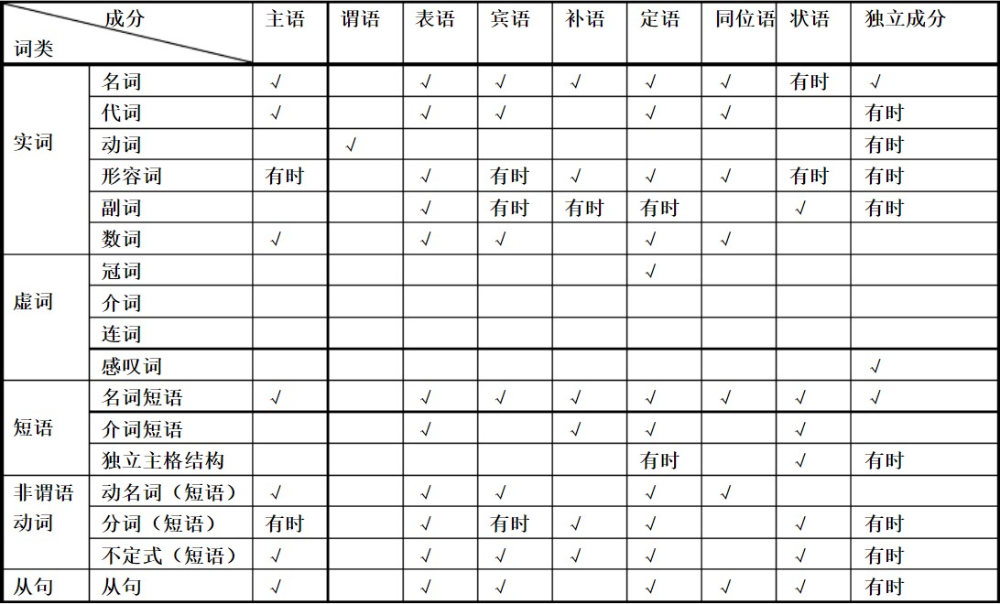

# 句子成分及词类

​	句子是由多个单词组成，而语法就是一种协调单词之间组合来表达意思的规则，单词由词性来划分一共有十种，这十种单词根据语法用不同的顺序及形式来表达意思。

| 分类 | 名称 | 缩写 | 意义 | 可用句子成分 |
| ---- | ---- | ---- | ---- | ------------ |
|      |      |      |      |              |
|      |      |      |      |              |
|      |      |      |      |              |
|      |      |      |      |              |
|      |      |      |      |              |
|      |      |      |      |              |
|      |      |      |      |              |
|      |      |      |      |              |
|      |      |      |      |              |

下面逐个讲解词类的含义

### 表格1

+ 名词-nouns (n.) 

  表示人或事物的名称,例如：小明(人名),北京(地名),箱子(物名),太阳(物名),狗(动物名)...

  凡是表示"名称"这个概念的都算是名词

+ 代词-pronouns (pron.)

  代替名词、数词、形容词We, this, them,myself

+ 动词-verb (v.) 

  表示动作或状态 Jump,sing,visit

+ 数词-numerals(num.)

  表示数目或顺序 one,two, first

+ 形容词-adjectives(adj)

  用来修饰名词，表示人或事物的特征 good, sad, high, short

+ 副词-adverbs（adv) 

  修饰动、形、副等词，表示动作特征 there,widely,suddenly

+ 冠词-articles (art.)

   用在名词前，帮助说明名词所指的范围 a, an, the

+ 介词-prepositions (prep.) 

  用在名词或代词前，说明它与别的词的关系 in,on,down,up

+ 连词-conjunctions (conj.) 

  表示人或事物的名称if,because,but

+ 感叹词-interjections (int.) 

  代替名词、数词、形容词等 oh,hello,hi,yeah

## 句子成分

1. 主语
2. 谓语
3. 宾语
4. 表语
5. 状语
6. 定语
7. 宾补
8. 同位语

## 句式

+ 主语+谓语
+ 主语+谓语+宾语
+ 主语+谓语+间接宾语+直接宾语
+ 主语+谓语+宾语+宾语补足语
+ 主语+系动词+表语
+ 祈使句：谓语(动词原形 )+宾语

