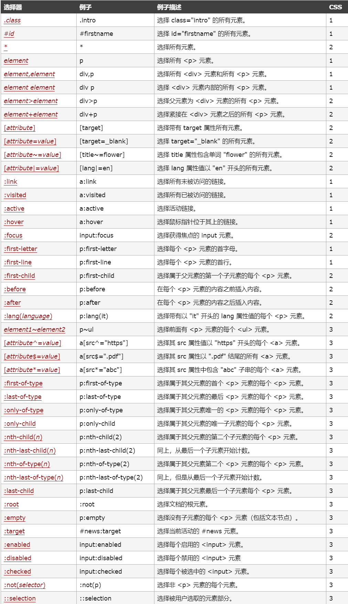

# css语法

## css插入

* 外部样式表
> \<link rel="stylesheet" type="text/css" href="[css-url]">
* 内部样式表
> \<head>
\
\</head>
* 内联样式
> \<[html标签] style="[css样式]">这是一个段落 \</[html标签]>

### 优先级

* 浏览器缺省设置
* 外部样式表
* 内部样式表（位于 head 标签内部）
* 内联样式（在 HTML 元素内部）

## css选择器

### 基本选择器

* \*---所有元素
* [元素]---元素选择器
* #[id]----id选择器
* .[class]---class选择器

### 组合选择器

* [元素][,元素] 可以同时设置多个元素
* [元素1] [元素2]---后代选择器：选择所有父元素有元素1的元素2
> 后代选择器元素1与元素2"之间"不能有div，span元素
* [元素1]>[元素2]---子选择器：选择所有上级元素是元素1的元素2
* [元素1]+[元素2]---选择所有紧邻元素1的元素2

### 属性选择器

* [attribute]----选择所有设置attribute属性的元素
* [attribute~=value]---选择所有设置了带有value关键字attribute的元素
* [attribute=value]---选择将attribute属性设为value的元素
* [attribute|=value]---选择所有设置了attribute属性值以value开头的元素
* 。。。

### 伪元素选择器

>CSS3规范中的要求使用双冒号(::)表示伪元素

### 伪类选择器

>CSS3规范中的要求使用单冒号(:)表示伪类

[总结伪类与伪元素](http://www.alloyteam.com/2016/05/summary-of-pseudo-classes-and-pseudo-elements/)

## css属性

### 背景

>简写格式：background:[background-color][background-image][background-repeat][background-attachment][background-position]

* background-attachment--背景图像是否固定或者随着页面的其余部分滚动。
* background-color-------设置元素的背景颜色。
* background-image-------把图像设置为背景。
* background-position----设置背景图像的起始位置。
* background-repeat------设置背景图像是否及如何重复

### 文本（Text）

* color-----------------设置文本颜色
* direction-------------设置文本方向。
* letter-spacing--------设置字符间距
* line-height-----------设置行高
* text-align------------对齐元素中的文本
* text-decoration-------向文本添加修饰
* text-indent-----------缩进元素中文本的首行
* text-shadow-----------设置文本阴影
* text-transform--------控制元素中的字母
* unicode-bidi----------设置或返回文本是否被重写 
* vertical-align--------设置元素的垂直对齐
* white-space-----------设置元素中空白的处理方式
* word-spacing----------设置字间距

### 字体（font）

>简写格式：font：[font-style] [font-variant] [font-weight] [font-size/line-height] [font-family]

* font-family-----------指定文本的字体系列
* font-size-------------指定文本的字体大小
* font-style------------指定文本的字体样式
* font-variant----------以小型大写字体或者正常字体显示文本。
* font-weight-----------指定字体的粗细。

### 链接（link）

>**背景,文本,字体都能进行设置**

### 列表

>简写格式：list-style:[list-style-type] [list-style-position] [list-style-image]

* list-style-image-------将图象设置为列表项标志。
* list-style-position----设置列表中列表项标志的位置。
* list-style-type--------设置列表项标志的类型

### 表格（table）

>可以把表格中的每个元素看成一个块元素，context，padding，border，margin

* border-collapse-----折叠边框

### css盒子模型

[盒子模型详解-掘金](https://juejin.im/post/59ef72f5f265da4320026f76)

#### 边框

>简写格式：border[-left/right/bottom/top]：[border-width] [border-style] [border-color]

* border-[left/right/bottom/top-]style:用于设置元素所有边框的样式，或者单独地为各边设置边框样式

>dotted: 定义一个点线框
dashed: 定义一个虚线框
solid: 定义实线边界
double: 定义两个边界。 两个边界的宽度和border-width的值相同
groove: 定义3D沟槽边界。效果取决于边界的颜色值
ridge: 定义3D脊边界。效果取决于边界的颜色值
inset:定义一个3D的嵌入边框。效果取决于边界的颜色值
outset: 定义一个3D突出边框。 效果取决于边界的颜色值

* border-[left/right/bottom/top-]width:简写属性，用于为元素的所有边框设置宽度，或者单独地为各边边框设置宽度
* border-[left/right/bottom/top-]color:简写属性，设置元素的所有边框中可见部分的颜色，或为 4 个边分别设置颜色。

#### 轮廓(outline)

>轮廓（outline）是绘制于元素周围的**一条线**，位于边框边缘的外围，可起到突出元素的作用
**简写格式：outline：[outline-color] [outline-style] [outline-width]**

#### 外边距（margin）

### 定位(position)

>设置元素定位模式

* absolute---------绝对定位的元素的位置相对于最近的已定位父元素
* fixed------------相对于浏览器窗口的位置，浏览器滚动，元素位置不变
* relative-----------相对定位元素的定位是相对其正常位置。
* static------------HTML元素的默认值，即没有定位，元素出现在正常的流中，静态定位的元素不会受到top, bottom, left, right影响
* inherit-----------继承父元素设置

### Other

#### 光标样式

>cursor属性用于当光标移动到元素时显示的样式，可选值：

* url
* auto
* crosshair
* default
* pointer
* move
* e-resize
* ne-resize
* nw-resize
* n-resize
* se-resize
* sw-resize
* s-resize
* w-resize
* text
* wait
* help

#### 内容溢出处理

>overflow用于设置当元素的内容溢出其区域时发生的事情，可选值：

* auto----------
* hidden--------不显示
* scroll--------添加滚动条来浏览全部内容
* visible-------展开显示
* inheri--------继承父元素的值