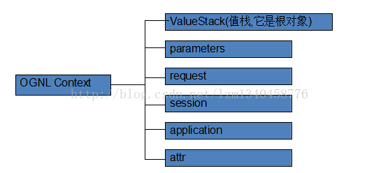
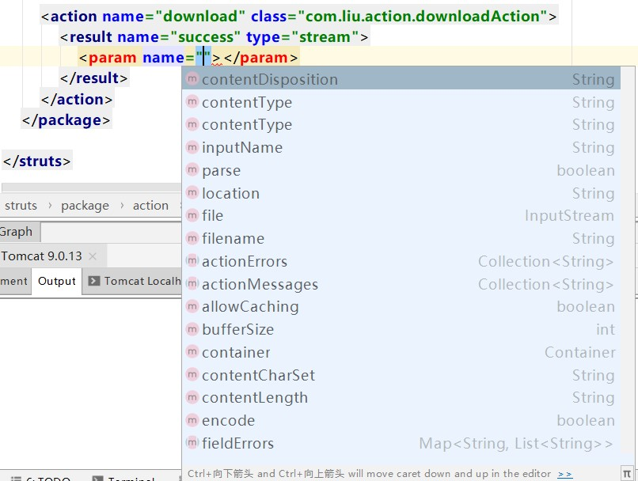

# struts2

## 操作（Actions）

### 定义action类

+ 普通pojo类
一个普通的类也可以是action类，应该提供一个`String execute()`方法来返回一个字符串决定跳转的页面,当然方法名并不是一定的,也可以用其他名字,但必须是==无参并且返回值是String类型的方法==,如果struts.xml中没有指定action的method属性，默认是execute()方法，所以最好有一个execute()方法
+ 实现com.opensymphony.xwork2.action类

```java
public interface Action {
    String SUCCESS = "success";
    String NONE = "none";
    String ERROR = "error";
    String INPUT = "input";
    String LOGIN = "login";
    String execute() throws Exception;
}
```

+ 继承`com.opensymphony.xwork2.ActionSupport`
ActionSupport类本质上也是实现Action接口,ActionSupport实现了Action接口,但是默认返回success,继承ActionSupport后需要重写execute)()方法

```java
public class ActionSupport implements Action, Validateable, ValidationAware, TextProvider, LocaleProvider, Serializable {
    //...其他方法
       public String execute() throws Exception {
        return "success";
    }
}

```

## 拦截器（Interceptors）

### 定义拦截器

+ 实现com.opensymphony.xwork2.interceptor.Interceptor

```java
public interface Interceptor extends Serializable {
    void destroy();
    void init();
    String intercept(ActionInvocation var1) throws Exception;
}
```

+ 继承com.opensymphony.xwork2.interceptor.AbstractInterceptor
AbstractInterceptor抽象类并没有对Interceptor有任何实现，当拦截器不需要初始化和销毁时可以继承AbstractInterceptor抽象类，只需要重写intercept方法即可

```java
public abstract class AbstractInterceptor implements Interceptor {
    public AbstractInterceptor() {}
    public void init() {}
    public void destroy() {}
    public abstract String intercept(ActionInvocation var1) throws Exception;
}
```

## 值栈（Value Stack）/OGNL

OGNL对象由值栈和上下文组成



### 值栈

**值栈为struts2 ognl根对象**

+ 当Struts2接受一个请求时，会迅速创建ActionContext，然后创建ValueStack，再创建action。接着把action存放到ValueStack中，所以action中的实例变量可以被OGNL表达式直接访问,如action中有getName()方法，可以直接在ognl表达式中用`<s:property value="name">`使用

#### 值栈取值

+ 获取普通值栈值:<s:property value="表达式" />
+ 获取对象属性值:<s:property value="[propery_key1].[propery_key1-1]"/>
使用[propery_key1]返回一个具体的对象，用点分割[propery_key1-1]获得该对象的[propery_key1-1]值
例如：

```java
public class ValueStackObject extends ActionSupport {
    private User user = new User();
    private Score score = new Score;

    public User getUser() {
        return user;
    }

    public Score getScore(){
        return score;
    }

    @Override
    public String execute() throws Exception {
        user.setUsername("张丹峰");
        user.setPassword("6666666");
        user.setAddress("上海");
        score.setStuname("张丹峰");
        score.setMath(88);
        score.setEnglish(70);
        score.setChinese(95);
        return "success";
    }
}

获得值：
<s:property value="user.username"/> //张丹峰
<s:property value="user.password"/> //6666666
<s:property value="user.address"/> //上海
<s:property value="score.stuname"/> //张丹峰
<s:property value="score.math"/> //88
<s:property value="score.chinese"/> //95
<s:property value="score.english"/> //70
```

+ 获取List具体对象值:
    + 方法一：使用下标

```java
<s:property value="list[0].name"/>
<s:property value="list[0].age"/>
<s:property value="list[1].name"/>
<s:property value="list[1].age"/>
```

    + 方法二：使用struts2标签

```java
<s:iterator value="list">
    <s:property value="name"/>
    <s:property value="age"/>
</s:iterator>
```

    + 方法三：

```java
<s:iterator value="list" vau="user">
    <s:property value="#user.name"/>
    <s:property value="#user.age"/>
</s:iterator>
```

+ 获取Map对象值:

#### 值栈放值

+ 获取值栈对象，调用值栈对象里面的set方法
`set(String propery_name, Object propery_value)`
+ 获取值栈对象，调用值栈对象里面的push方法
`push(Object obj)`
+ 在action定义变量，生成变量的get方法（常用）

+ 使用<s:property value="Property-Name"/>取普通对象值

### OGNL中重要的3个符号：#、%、$

#### 1.\#

\#一般有三种作用：

+ 访问非根对象属性，例如#session.msg表达式，由于Struts 2中值栈被视为根对象，所以访问其他非根对象时，需要加#前缀。实际上，#相当于ActionContext. getContext()；#session.msg表达式相当于ActionContext.getContext().getSession(). getAttribute("msg") 
+ 用于过滤和投影(projecting)集合,如persons.{?#this.age>25},persons.{?#this.name=='pla1'}.{age}[0]
+ 用来构造Map，例如示例中的#{'foo1':'bar1', 'foo2':'bar2'}

#### 2.%

%符号的用途是在标志的属性为字符串类型时，计算OGNL表达式的值，这个类似js中的eval，很暴力

#### 3.$

$符号主要有两个方面的用途:

+ 在国际化资源文件中，引用OGNL表达式，例如国际化资源文件中的代码：reg.agerange=国际化资源信息：年龄必须在\${min}同${max}之间。
+ 在Struts 2框架的配置文件中引用OGNL表达式，例如：

```java
<validators>  
    <field name="intb">  
            <field-validator type="int">  
            <param name="min">10</param>  
            <param name="max">100</param>  
            <message>BAction-test校验：数字必须为${min}为${max}之间！</message>  
        </field-validator>  
    </field>  
</validators>
```

## 结果（Result）/结果类型

**struts2支持类型**

```java
<result-types>
    <!--Action链式处理的结果类型-->
    <result-type name="chain" class="com.opensymphony.xwork2.ActionChainResult"/>

    <!--用于与JSP整合的结果类型，作为默认的结果类型-->
    <result-type name="dispatcher" class="org.apache.struts2.dispatcher.ServletDispatcherResult" default="true"/>

    <!--用于与FreeMarket整合的结果类型-->
    <result-type name="freemarker" class="org.apache.struts2.views.freemarker.FreemarkerResult"/>

    <!--用户控制特殊的HTTP行为的结果类型-->
    <result-type name="httpheader" class="org.apache.struts2.dispatcher.HttpHeaderResult"/>

    <!--用于直接跳转到其它URL的结果类型-->
    <result-type name="redirect" class="org.apache.struts2.dispatcher.ServletRedirectResult"/>

    <!--用于直接跳转到其它Action的结果类型-->
    <result-type name="redirectAction" class="org.apache.struts2.dispatcher.ServletActionRedirectResult"/>

    <!--用于向浏览器返回一个InputStream的结果类型-->
    <result-type name="stream" class="org.apache.struts2.dispatcher.StreamResult"/>

    <!--用于整合Velocity的结果类型-->
    <result-type name="velocity" class="org.apache.struts2.dispatcher.VelocityResult"/>

    <!--用于整合XML/XSLT的结果类型-->
    <result-type name="xslt" class="org.apache.struts2.views.xslt.XSLTResult"/>

    <!--用于显示某个页面原始代码的结果类型-->
    <result-type name="plainText" class="org.apache.struts2.dispatcher.PlainTextResult" />

    <!--将请求参数以form的形式提交到指定地点的结果类型-->
    <result-type name="postback" class="org.apache.struts2.dispatcher.PostbackResult" />
</result-types>
```

+ dispatcher(默认)
**跳转到指定页面(jsp,html)**
四个参数
    + location:指定要跳转的路径
    + encode:
    + parse:布尔值，决定是否把location参数当作OGNL表达式解析
    + urlHelper:
+ Velocity
+ Freemaker
+ XSLT
+ chain
+ redirect
+ redirectAction
+ httpheader
+ stream
+ plainText
+ postback

## 文件上传与下载

### 上传

上传文件必须把form表单method属性设为post，并提供enctype=

#### 单文件上传

在action中声明三个固定名称和类型的对象，并提供setter，getter方法
File [文件上传字段name属性];
String [文件上传字段name属性+FileName];
String [文件上传字段name属性+ContentType];
struts内部会把上传的文件封装成file对象，并把文件名称，文件类型传递给响应属性，得到文件对象，文件名，文件类型就可以进行进一步操作

#### 多文件上传

方法同单文件上传，只不过把对象换成数组而已
File[] [文件上传字段name属性];
String[] [文件上传字段name属性+FileName];
String[] [文件上传字段name属性+ContentType];

#### 文件上传拦截器--fileUpload

struts2内置一个fileUpload拦截器，用于拦截不合法文件，fileUpload有三个常用param：
allowedTypes：用于限制上传文件格式，多个值英文逗号隔开
allowedExtensions：用于限制上传文件扩展名，多个值英文逗号隔开
maximumSize：用于限制上传文件大小，单位字节
**要点**

+ struts.multipart.maxSize用于设置上传文件大小，单位字节
+ 当上传文件出错会返回'input'字符串，所以应提供input result和错误字段
+ 默认拦截器必须放在fileUpload之后，否则无效
+ action必须继承ActionSupport或实现Action,否则无效

### 下载

下载需要把result标签type属性设为stream,这样往用户发数据就是以文件流的形式发送，具体操作

```java
<result name="xxx" type="Stream">
    <param name="xxx">value</param>
</result>
```


例如：

```java
<result name="success" type="stream">
    <param name="inputName">file</param>
    <param name="contentType">${contentTypefield}</param>
    <param name="contentDisposition">attachment;filename="${filename}"</param>
</result>

action需要提供相应getter/setter方法，例如本例应该出现`InputStream getFile`,`String getContentTypefield`,`String getFilename()`方法来提供相应的值
```

## 视图技术

### 国际化

国际化分为三类：全局的，包级别的，类级别的。

**全局的：**
   1，在struts.xml中的`<constant name="struts.custom.i18n.resources" value="baseName"></constant>`指定baseName
   国际化文件名为：baseName_语言名_国家名.properties（如：message_zh_CN.properties）
   2，全局的国际化资源文件放在src下面。

**包级别的：**
   1，包级别的国际化资源文件放在该包下面。
   2，命名规则为：package_语言名_国家名.properties(如：package_zh_CN.properties)
      其中package不变，不是指的是包名，每个包的国际化文件命名都这样。

**类级别的：**
   1，与该类放在同一目录中
   2，命名规则为：类名_语言名_国家名.properties（如：RegisterAction_zh_CN.properties）

若同一key 在上面三个国际化文件中都为value值则：（优先级）类级别的>包级别的>全局的

创建国际化步骤：

+ 指定国际化baseName属性名
    * 在struts.xml中指定：`<constant name="struts.custom.i18n.resources" value="baseName"></constant>`
    * 在struts.properties中配置`struts.custom.i18n.resources=baseName`
+ 创建国际化文件
    和struts.xml同目录创建格式为[baseName].[语言].[国家].properties文件
    文件内容为key=value格式
使用国际化

在jsp中使用国际化

在action中使用国际化

## 补充
