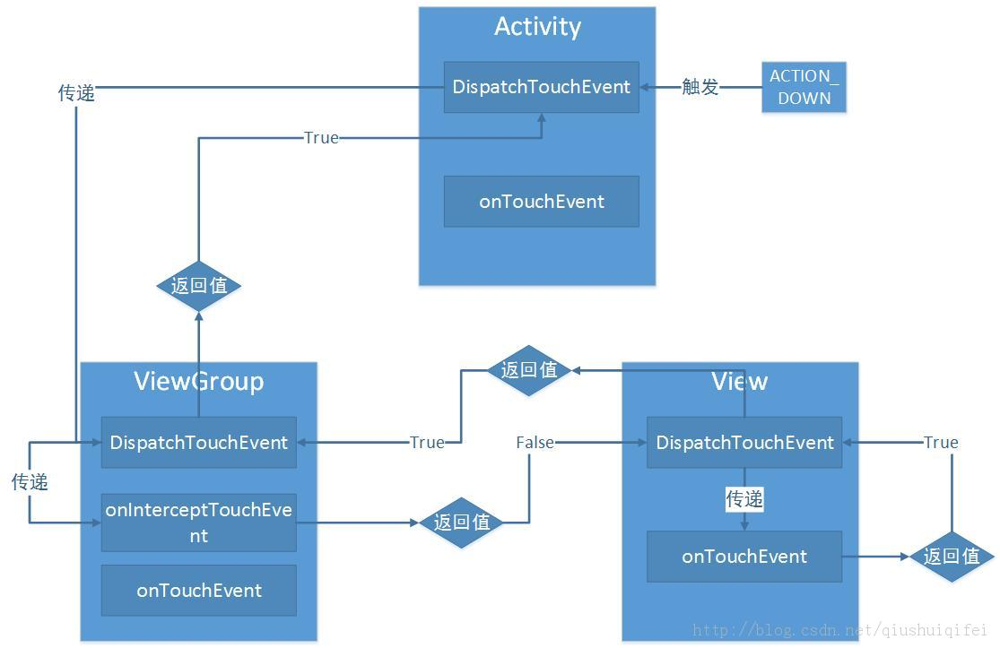

# Android 事件传递机制

我们对屏幕的每一次操作，如点击，滑动，双击等等，都是伴随着一系列事件的发生，点击是一个操作，可对安卓系统来说是两个事件，down和up，如果滑动的话还会多一系列的move事件。
我们最常使用的View.OnClickListener()方法实际上是安卓为我们封装好的一个简单操作，当view接收到一个down和一个up事件时触发View.OnClickListener()方法。
我们应该怎么自定义操作的，如滑动，双击，长按等，安卓事件触发机制跟`dispatchTouchEvent()、onInterceptTouchEvent()和onTouchEvent()`这三个方法有关，学完这三个就可以自定义触发操作对事件传递机制有一个更深的理解了。

## Android中的dispatchTouchEvent()、onInterceptTouchEvent()和onTouchEvent()

先来简要的概述一下这三个方法：

* dispatchTouchEvent():
    return True if the event was handled by the view, false otherwise.
    如果事件由视图处理，则为True，否则为false。
* onInterceptTouchEvent()：
    return：Return true to steal motion events from the children and have them dispatched to this ViewGroup through onTouchEvent(). The current target will receive an ACTION_CANCEL event, and no further messages will be delivered here
    返回true以从子节点窃取运动事件，并通过onTouchEvent（）将它们分派到此ViewGroup。 当前目标将收到ACTION_CANCEL事件，此处不会再传递任何消息
* onTouchEvent是处理事件的方法
    return:True if the event was handled, false otherwise.
    如果事件被处理则为True，否则为false。
    正常情况一个事件只会被一个view或viewgroup处理
View里，有两个回调函数：

```java
public boolean dispatchTouchEvent(MotionEvent ev)；  
public boolean onTouchEvent(MotionEvent ev);
```

ViewGroup里，有三个回调函数 ：

```java
public boolean dispatchTouchEvent(MotionEvent ev)；  
public boolean onInterceptTouchEvent(MotionEvent ev);  
public boolean onTouchEvent(MotionEvent ev);
```

三个方法的执行顺序：

首先activity接收到事件执行dispatchTouchEvent()方法进行调度
在dispatchTouchEvent()方法中调用对应(事件所覆盖的对应区域)view(ViewGroup也算view)的dispatchTouchEvent()方法进行处理
ViewGroup的dispatchTouchEvent()接收到事件，传递给onInterceptTouchEvent()决定是否拦截，此时会出现两种情况：

* onInterceptTouchEvent()经过判断不需要拦截，返回false,ViewGroup会继续将事件传递给子组件进行处理
* onInterceptTouchEvent()经过判断需要拦截，返回true,ViewGroup会调用该view的onTouchEvent()方法进行处理，此时又会出现两种情况:
    * 经过onTouchEvent()方法处理过后已经没必要再继续向子组件传递了，返回true，表示此事件已经被消费，完结了，会一级一级向上传递true
    * 经过onTouchEvent()方法处理过后觉得子组件可能需要再处理一下，返回false，ViewGroup会继续向下传递

dispatchTouchEvent()的作用主要是调度，接收到事件后会先行判断自己要不要消费/处理这个事件，如果不需要处理或子组件仍需要会调用子组件的dispatchTouchEvent()方法，由子组件进行判断
onInterceptTouchEvent()是ViewGroup才有的方法，用于判断要不要拦截这个事件，如果拦截那就返回true，会调用此view的onTouchEvent()方法进行处理，如果不需要拦截直接返回false，会将此事件传递给子组件
onTouchEvent()是处理事件的方法，对事件的实际处理动作应该写在这个方法中，此方法返回的也是一个Boolean值，表明是不是已经消费了这个事件。被消费的事件不会向下或向上传递。

## 总结

从view与view的角度来看，子view和父view只会通过dispatchTouchEvent()方法进行通信，父view将view传递给子view，子view返回给父view是不是已经消费该事件。
而onInterceptTouchEvent和onTouchEvent是在view内部进行处理的，决定是不是要消费该事件，或者消费不了传递给子view。主要用于判断和处理事件。
