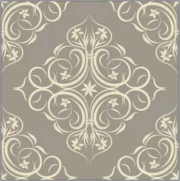

# 自定义drawable

> drawable在安卓中表示的是一种图像，drawable不仅仅是图片，drawable多用于view的背景，使用drawable可以让我们实现一些自定义的效果而又不用自定义view.

## 1. BitmapDrawable

bitmapdrawable表示一张图片，在实际开发中我们可以直接引用原始图片即可，使用xml配置可以设置更多的效果

```xml
<?xml version="1.0" encoding="utf-8"?>
<bitmap
    xmlns:android="http://schemas.android.com/apk/res/android"
    android:src="@[package:]drawable/drawable_resource"
    android:antialias=["true" | "false"]
    android:dither=["true" | "false"]
    android:filter=["true" | "false"]
    android:gravity=["top" | "bottom" | "left" | "right" | "center_vertical" | "fill_vertical" | "center_horizontal" | 			"fill_horizontal" | "center" | "fill" | "clip_vertical" | "clip_horizontal"]
    android:tileMode=["disabled" | "clamp" | "repeat" | "mirror"] />
```

下面是他各个属性的含义

+ android:src

  图片id的资源（必填）

+ **android:antialias**
  表示：是否开启抗锯齿功能( 默认值 true)（建议开启）。

+ android:dither
  表示：是否允许开启抖动效果( 默认值 true)（建议开启）。当位图与屏幕的像素配置不同时，开启这个选项可以让搞资料的图片在低质量的屏幕上还能较好的显示效果。（例如：一个位图的像素设置是 ARGB 8888，但屏幕的设置是RGB 565，如果不开启抖动效果，图片显示就会失真）

+ android:filter
  表示：是否允许对位图进行滤波( 默认值 )（建议开启）。对位图进行收缩或者延展使用滤波可以获得平滑的外观效果。

+ android:gravity
  表示：如果位图小于其容器时，设置位图显示的位置（此选项可以同“ | ”来组合使用）

+ android:tileMode
  表示：平铺模式。开启改功能以后 android:gravity 属性会失效。

  - disabled ：表示平铺模式不可用 ( 默认值 )
  - clamp ：表示位图周围的像素会扩展到周围区域
  - repeat ：表示水平和竖直方向上的铺平效果。
  - mirror ：表示水平和竖直方向上的镜面投影效果

  **android:tileMode 图文分析：**

  原图：

  

  clamp 模式：

  

  repeat 模式：

  

  mirror 模式：（说明：此处采用的是ic_launcher图片作为 src）

  

  

## 2. ShapeDrawable

ShapeDrawable是一种常见的Drawable，可以理解为通过颜色来构造的图形，既可以是纯色的图形，也可以是具有渐变效果的图形

```xml
<?xml version="1.0" encoding="utf-8"?>
<shape
    xmlns:android="http://schemas.android.com/apk/res/android">
    <solid/>
    <corners/>
    <gradient/>
    <padding/>
    <size/>
    <stroke/>
</shape>
```

### shape标签

shape标签有如下属性：

+ android:shape

  他表示图形的形状，有四个选项：rectangle(矩形)，oval

## 3. LayerDrawable

LayerDrawable对应`<layer-list/>`标签

## 4. StateListDrawable

StateListDrawable对应`<selector/>`标签

## 5. LevelListDrawable

LevelListDrawable对应`<level-list/>`标签

## 6. TransitionDrawable

TransitionDrawable对应于`<transition/>`标签

## 7. InsetDrawable

InsetDrawable对应于`<inset/>`标签

