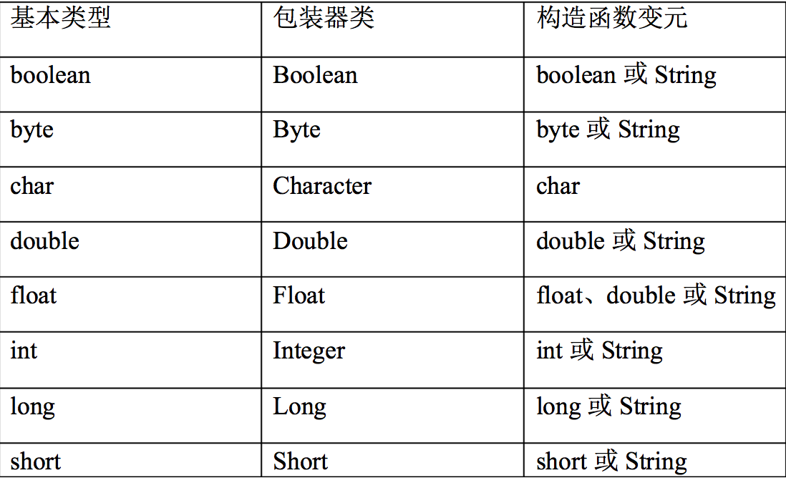

# java基础

## 修饰符

+ public
公共的，所有人都可以访问
+ protected
对子类,同包类来说是public，对其他类来说是private
+ private
私有的，除了本类，其他类都不能访问
+ 无修饰符
对本包内的所有类都是public，对包外类来说是private

## 包装器类



+ 要点一：构造函数

>除了Character类之外，所有包装器类型都有两个构造函数，一个是以要构建的基本类型为参数,一个以String为参数

    Character character = new Character('a');
    Integer int1 = new Integer("1");
    Integer int2 = new Integer(1);

+ 要点二：valueOf()方法

>大部分包装器类都有valueOf()方法用于将其他包装器类型转化成自身包装器类型

    String.valueOf(1);
    String.valueOf(false);
    Integer.valueOf("11");
    ...

+ 要点三：parseXxx()

>将指定类型转换成自身类型，与valueOf()不同的是，parseXxx()返回的是基本类型

    Integer.parseInt("11"); //返回int基本类型
    Boolean.parseBoolean("false"); //返回boolean基本类型
    ...

+ 要点四：toString()

>所有包装器类都重写了toString方法

==**补充**==
每个声明的基本数据类型都有一个默认值，所有不用担心忘记初始化问题

+ boolean----------------false
+ char-------------------'\u0000'(null)
+ byte-------------------(byte)0
+ short------------------(short)0
+ int--------------------0
+ long-------------------0L
+ float------------------0.0f
+ double-----------------0.0d

## final关键字

>根据上下文环境，Java关键字final的含义存在细微的差别，但通常它指“这是无法改变的”，不想做出改变可能处于两种原因：设计或效率。

### final数据

---

Q1:final修饰的数据(属性)在编译器就确定了?
A:
Q2:final修饰的数据(属性)完全不能更改?
A:
Q3:final修饰的数据(属性)值唯一?
A:
Q4:在定义final属性的时候必须被初始化?
A:
Q5:==定义方法参数为final有什么意义?==
A:

---

### final方法

>使用final方法的原因有两个：
第一个原因是把方法锁住，以放任何继承类修改他的含义，这是出于设计考虑：想要确保在继承中使方法行为保持不变，并且不会被覆盖。
第二个原因是效率，在Java的早期将方法指明为final，jvm会对此进行特殊处理，但这种处理并不全是性能的提升，也有可能导致性能下降，所以在近期的jvm中取消了对final方法的特殊处理。
所以，现在使用final关键字都是出于第一种目的。0

### final类

很简单，把一个类声明为final类，就相当于给该类"结扎",该类不允许有子类，也就是不能被继承。

## 多态

+ **要点一**

多态只会伴随在方法调用才会出现，属性不会出现多态现象，如：

```java{.line-numbers}
class super{
    public int field = 0;
    public int getField(){
        return field;
    }
}
class sub extends super{
    public int field = 1;
    public int getField(){
        return field;
    }
    public static void main(String[] args){
        super sup = new sub();
        System.out.println(sup.field);//输出：0；属性不会出现多态
        System.out.println(sup.getField);//输出：1；方法会出现多态
    }
}
```

+ **要点二**

private方法被隐式final修饰，例如：

```java{.line-numbers}
class super{
    private String field = "super-field";
    private String getField(){
        return field;
    }
}
class sub extends super{
    private String field = "sub-field";
    public String getField(){
        return field;
    }
    public static void main(String[] args){
        super sup = new sub();
        System.out.println(sup.getField);//输出：super-field；super类的getField方法是私有的，隐式final不可继承，也就是调用的super类的private getString方法，这是因为它和main方法在同一个类中，如果main在另一个类中则不能调用private方法
    }
}
```

---
Q1:**==new一个子类对象会执行父类的构造函数，那么，new一个子类的同时也会创建一个父类对象吗？==**
A:
Q2:

```java{.line-numbers}
class Glyph{
    void draw(){System.out.println("Glyph.draw()");}
    Glyph(){
        System.out.println("Glyph() before draw()");
        draw();
        System.out.println("Glyph() after draw()");
    }
}

class RoundGlyph extends Glyph{
    private int radius = 1;
    RoundGlyph(int r){
        radius = r;
        System.out.println("RoundGlyph.RoundGlyph(),radius = "+radius);
    }
    void draw(){
        System.out.println("RoundGlyph.draw(),radius = "+radius);
    }
}
public class PolyConstructors{
    public static void main(String[] args){
        new RoundGlyph(5);
    }
}
```

q1:为什么会执行RoundGlyph类的draw方法，并==没有类型转换也会存在多态现象==？
a1：
q2:调用RoundGlyph类的draw方法，radius属性为什么值为0？难道还没有初始化？
a2:
**扩展**：
>对象初始化过程：
1.在其他任何事物发生之前，将分配给对象的存储空间初始化为二进制的0(不加电)
2.调用基类的构造器
3.按照声明的顺序调用成员的初始化方法
4.调用子类的构造器主题

## 接口

+ 接口中的任何字段都必须被初始化且被public static final修饰(接口中定义的字段都为常量)
+ 接口中任何方法都会被public 修饰
+ 接口中的任何类(内部类)都会被public static修饰

### 接口中可以有三种方法

#### 抽象方法

#### 静态方法

#### 默认方法

## 内部类

+ **内部类不仅可以定义在类中，也可以定义在方法及任何作用域中，if语句、for循环...**

+ **内部类访问外部类对象方式**

    在内部类中使用 <kbd>[外部类类名].this</kbd> 方式即可获得一个外部类对象引用。

+ **在其它类中创建内部类对象**

    ==创建内部类必须得到外部类对象==，应使用语法<kbd>[外部类对象].new [内部类构造方法]</kbd>来创建内部类对象。

### 局部内部类

>除外部类中以外定义的内部类都叫局部内部类(在外部类中定义的类可以称为"全局内部类"),主要定义在内部类中(内部类中定义内部类),方法中,if语句,for循环...

### 匿名内部类

>没有"类名"的内部类称为匿名内部类，匿名内部类只能在哪里定义在哪里使用

**==匿名内部类构造函数可以有参数,匿名内部类构造函数可以有参数,匿名内部类构造函数可以有参数==**

+ 用法一：
    new [className](arg){[内容]}
    表示在此处定义一个继承了[className]的内部类，构造方法有没有参数由[className]指定
+ 用法二：
    new [abs-className](arg){[内容]}
    表示在此处定义一个继承了[abs-className]抽象类的内部类，构造方法有没有参数由[abs-className]指定
+ 用法三：
    new [interfaceName]\(){[内容]}
    表示在此处定义一个实现了[interfaceName]接口的内部类，构造方法不能有参数

#### 由于匿名内部类没有类名，所以不能有构造函数(跟上面不冲突),如果想实现初始化作用，可以使用代码块的形式，如：

```java{.line-numbers}
public class outer{
    public interface demo{
        void println();
    }
    demo getDemo(){
        return new demo(){
            String s;
            {
                s = "hello";
                System.out.println("这里会被先执行");
                [init-code]
            }
            public void println(){
                System.out.println(s);
            }
        }
    }
    public static void main(String[] args){
        new outer().getDemo();
    }
}
```

### 嵌套类

>如果不需要内部类和外部类有联系，可以将内部类声明为static，这通常称为嵌套类

+ **嵌套类和普通内部类区别：**
    普通内部类的方法和字段只能放在类的外部层次上，所以普通内部类不能有static数据和字段，也不能包含嵌套类，但是嵌套类可以包含所以这些东西。

### 为什么使用内部类？

+ 一般来说，由内部类操作创建它的外部类对象，所以可以说内部类提供了某种进入外部类的窗口
+ 内部类提供了可以继承多个具体的或抽象的类的能力
    每个内部类都能对立的继承自一个类，所以无论外部类是否已经继承了某个类，对于内部类都不受影响

## String对象

### String对象不可改变，每次对String操作产生的字符串都是一个新的字符串 ###

```java{.line-numbers}
public static void main(String[] args){
    String s1 = "abc";
    String s2 = s1;     //把s1指向的abc字符串引用给s2
    s1 = s1.toUpperCase();  //toUpperCase()方法产生一个新的字符串给s1
    System.out.println(s1);
    System.out.println(s2);
}
/*out:
    ABC
    abc
*/
```

### 格式化输出

#### formatter格式化

[java.util.Formatter文档](https://docs.oracle.com/javase/7/docs/api/java/util/Formatter.html)

JDK1.5开始String类中提供了一个非常有用的方法String.format(String format, Object ... args)
查看源码得知其实是调用了java.util.Formatter.format(String, Object...)方法
**<center>format格式：<kbd>(String format, Object ... args)</kbd></center>**
最重要的的地方就是它的第一个参数String format,我们只要掌握了这个参数的用法也就掌握了String.format的用法
查看JDK文档得知,String.format方法的第一个参数是有个公式可以套的
> **%[argument_index$][flags][width][.precision]conversion**

+ %:表示一个占位符的开始，跟后面的一个参数对应
+ \[argument_index$]:可选参数，此占位符对应后面第index个参数，不指定依次递增

```java{.line-numbers}
String.format("%s%s","firstarg","secondarg");         return "firstargsecondarg"
String.format("%2$s%1$s","firstarg","secondarg");     return "secondargfirstarg"
```

+ \[flags]:可选参数，用来控制输出格式
+ \[width]:可选参数，
+ \[.precision]:可选参数，
+ conversion:

### 正则表达式

## 反射

+ getClass()方法源码```public final native Class<?> getClass();```
    final不可继承为什么子类却可以用？
    怎么实现的？jvm实现的？

## 泛型

+ 反省只有在编译器有效，证明：

```java{.line-numbers}
List<String> stringArrayList = new ArrayList<String>();
List<Integer> integerArrayList = new ArrayList<Integer>();

Class classStringArrayList = stringArrayList.getClass();
Class classIntegerArrayList = integerArrayList.getClass();

if(classStringArrayList.equals(classIntegerArrayList)){
    Log.d("泛型测试","类型相同");
}
//输出结果：
类型相同
```

> 泛型有三种使用方式，分别为：泛型类、泛型接口、泛型方法

### 泛型类

> 泛型类型用于类的定义中，被称为泛型类。通过泛型可以完成对一组类的操作对外开放相同的接口,**泛型类，是在实例化类的时候指明泛型的具体类型**。最典型的就是各种容器类，如：List、Set、Map

```java{.line-numbers}
class [className]<泛型标识>{
    ...//在类主题中使用泛型标识
}
例如：
public class Generic<T>{ 
    //key这个成员变量的类型为T,T的类型由外部指定  
    private T key;

    public Generic(T key) { //泛型构造方法形参key的类型也为T，T的类型由外部指定
        this.key = key;
    }

    public T getKey(){ //泛型方法getKey的返回值类型为T，T的类型由外部指定
        return key;
    }
}
```

### 泛型接口

>同泛型类

### 泛型方法

>泛型方法，是在调用方法的时候指明泛型的具体类型

```java{.line-numbers}
[方法修饰符] <泛型标识> [方法返回类型]([方法形参]){
    ...方法体
}
例如：
public class Demo{
    public <T>  void Method(T a){
        System.out.println(a);
    }
}

使用：
new Demo().<Integer>Method(1); //输出1
new Demo().<Integer>Method("1"); //编译不通过

```

### 泛型继承/实现

```java{.line-number}
class basic<T,F>{
    T t;
    F f;
    basic(T t,F f){
        System.out.println(t);
        System.out.println(f);
    }
}
继承方式一：
class sub1<T,F> extends basic<T,F>{
    ...
}
继承方式二：
class sub2 extends basic<String,Integer>{
    ...
}
继承方式三：
class sub3 <T,F> extends basic<String,Integer>{
    ...
}
前三种都是正确的继承方式，一下举几个反面例子：
错误继承方式一：
class sub4 extends basic{
    ...
    //根本没有继承，此时basic泛型类型都是Object
}
class sub5<String,Integer> extends basic{
    ...实际效果同错误继承方式一，类名后面泛型直接写具体类型，和没写一样不会传到basic类中
}
class sub6<String,Integer> extends basic<T,F>{
    ...编译不通过，在类名后面没有定义泛型标识T，F(用具体类型标识等于不标识)
}
```