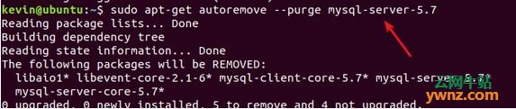

# 记一次ubuntu安装mysql8.0并改变datadir的过程

## 安装5.7

第一次是使用apt install mysql-server安装mysql，执行完并没有让设置密码的那一步，所以用mysql -u root -p没办法登陆，解决方案是：在/etc/mysql/中会有一个debian.cnf 文件，文件格式大概是这样：

```xml
[client]

host   = localhost

user   = debian-sys-maint

password = hGu99nJgoWcmCDKT

socket  = /var/run/mysqld/mysqld.sock

[mysql_upgrade]

host   = localhost

user   = debian-sys-maint

password = hGu99nJgoWcmCDKT

socket  = /var/run/mysqld/mysqld.sock

basedir = /usr
```

里面有默认用户名和密码，用于登陆更改密码

更改密码命令是

`update mysql.user set authentication_string=password('你的密码') where user='root'and Host = 'localhost';`

之后就可以用root用户登陆了


坑爹的是，apt-get命名默认安装的是mysql5.7，无奈只能删除重新安装

### 清理mysql5.7方案

1. 首先在系统终端中查看MySQL的依赖项，运行命令：dpkg --list|grep mysql


2. 卸载命令：sudo apt-get remove mysql-common


3. 卸载命令：sudo apt-get autoremove --purge mysql-server-5.7



4. 清除残留数据，运行命令：dpkg -l|grep ^rc|awk '{print$2}'|sudo xargs dpkg -P


5. 再次查看MySQL的剩余依赖项，运行命令：dpkg --list|grep mysql


6. 继续删除剩余依赖项，如：sudo apt-get autoremove --purge mysql-apt-config


至此已经没有了MySQL的依赖项，彻底删除MySQL5.7版本了。

## 安装8.0方法

1. 去http://dev.mysql.com/downloads/repo/apt/.下载一个mysql-apt-config_xxx_all.deb，使用


   sudo dpkg -i mysql-apt-config_xxx_all.deb


   安装执行，选择MySQL8.0，OK。

2. 然后apt update一下


   使用sudo apt install mysql-server命令，就会安装MySQL8.0

3. 按此方法会在安装过程中出现如下界面要求用户输入MySQL密码

   一定要注意，MySQL8.0采用了新的加密方式，正是因为这个加密方式才导致Ubuntu18.04用设置的root密码登录不了MySQL，因为Ubuntu18.04的终端可能有问题，并不支持这个新的加密方式。幸好有界面可以让我们选择使用旧版本5.x的加密方式，所以果断选择采用5.x的加密方式。

4. 最后在终端输入mysql -u root -p命令并输入密码检查安装成功而且可以看到MySQL版本号为8.0！！

## 接下来就是最刺激的更改数据库路径了

mysql的配置文件路径在`/etc/mysql/mysql.conf.d/etc/mysql/mysql.conf.d`

大概长这个样子

[](https://1.bp.blogspot.com/-VVEgj6iR_E4/XbOwEiL54LI/AAAAAAAABzk/rocSK8qk-NYUAFTkm7uy8vZD_Xfx_yPOACLcBGAsYHQ/s1600/2019-10-26%2B10-31-28%E5%B1%8F%E5%B9%95%E6%88%AA%E5%9B%BE.png)

不就是修改datadir嘛！easy，停止mysql服务，更改datadir配置，启动mysql服务

报错！！！

```
Job for mysql.service failed because the control process exited with error code. See "systemctl status mysql.service" and "journalctl -xe" for details.
```

什么鬼
打开错误log文件查看
`[Warning] Can't create test file /var/local/mysql/XXXX.lower-test`

没权限？

最后经过数次chown和chmod新数据目录或者其父路径的属主和权限之后，还是以失败告终。经过一下午的排查，发现问题apparmor，这个坑爹货和selinux一样的坑爹，它也对mysql所能使用的目录权限做了限制在 `/etc/apparmor.d/usr.sbin.mysqld` 这个文件中，有这两行，规定了mysql使用的数据文件路径权限


你一定看到了，/var/lib/mysql/就是之前mysql安装的数据文件默认路径，apparmor控制这里mysqld可以使用的目录的权限

我想把数据文件移动到/data/mysql下，那么为了使mysqld可以使用/data/mysql这个目录，照上面那两条，增加下面这两条就可以了

/newdatadirpath/ r,

/newdatadirpath/** rwk,

重启: sudo service apparmor restart

之后，就可以顺利地干你想干的事儿了。

等等，你以为这样就完事了

`service mysql start`

还是报错，和之前一样，有排查了一下error.log发现有新的错误了

`./mysql-bin.index' not found (Errcode: 13) `

无奈，google一下，马上知道

原来由于mysql开启了bin日志功能，到数据库根目录查看该文件是存在的，可能是文件权限的问题，查看了数据库根目录的权限是700，所有者和用户组都是root，可能是上次转移数据库的时候不小心修改了文件夹的权限。

解决方案是：

`chgrp -R mysql /newdatadirpath && chown -R mysql /newdatadirpath`

重启mysql，完事

## 参考文献

[Ubuntu18.04安装MySQL8.0](https://blog.csdn.net/Iversonx/article/details/80341596)

[ubuntu安装mysql 时未提示输入密码](https://blog.csdn.net/sinat_21302587/article/details/76870457)

[在Ubuntu18.04系统下彻底删除MySQL的方法](https://ywnz.com/linuxysjk/3141.html)

[MySQL [Warning] Can’t create test file xxx lower-test（转）](https://www.cnblogs.com/ajianbeyourself/p/4158874.html)

['./mysql-bin.index' not found (Errcode: 13) 的解决方法](https://blog.csdn.net/aidenliu/article/details/6586775)

