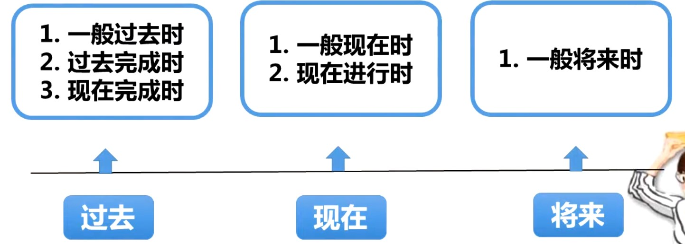

# 常用时态

## 一般现在时

**经常或习惯发生的动作或状态**

①常用的时间状语

They go to the palace Museum ==once a year==

They ==often== discuss business in the evening

②表示客观真理、事实、人的技能或现在的状态时句子里一般不用时间状语。

The earth ==turns== round the sun.

Light ==travels== faster than sound.

③表十分确定会发生(如安排好的事情)或按照时间表进行的事情

用一般现在表将来,句子中可以有将来时间

The train for haikou ==leaves== at 8: 00 in the morning.

④时间状语从句和条件状语从句,一般现在时代一般将来时

主将从现

Please ring me up as soon as you arrive in germany

If it rains tomorrow, we will have to stay at home

## 一般过去时

①表过去的动作或状态;

②可能是一次性也可经常发生。

Little Tom broke the window at half past nine this morning

When he went into the room he saw a stranger talking with his father

He came to our city in the year 2000

## 一般将来时

表将来某一时刻或经常发生的动作或状态。

①时间状语。

②will表动作与人的主观愿望无关

"shall用于第一人称,“will"用于所有人称;

“am/is/ are going to+动词原形”，“am/is/ are to+动词原形”

“be about to+动词原形”表打算或准备要做的事情,或主观判断即将要发生的事情。

I will graduate from this school soon

It's going to rain soon

## 现在进行时

①be( am is are)+现在分词

I am writing a long novel

②表即将发生的动作一般指近期安排好的事情。

What are you doing tomorrow?

③表频繁发生或反复进行的动作常与 always等频度副词连用以表示赞扬、不满或讨厌等感情色彩。

He ==is always borrowing== money from me and ==forgetting== all about it some time later

## 过去进行时

①"was或were+动词ing"

②过去进行时的时间状语

③用于宾语从句或时间状语从句中,表示与主句动作同时进行而且是延续时间较长。句子中通常不用时间状语。

He ==was cooking== supper this time yesterday

The little girl ==was playing== with her toy when I saw her.

she was it happen when she ==was walking== past.

They sang a lot of songs while they ==were walking== in the dark forest.

## 现在完成时

①have (has)+done

②时间状语

I have never seen such fine pictures before.

He has just gone to England.

③表在过去开始一直延续到现在的动作或状态,或对现在仍有影响

I have been away from my hometown for thirty years

Uncle Wang has worked in the factory since it opened

④在完成时中一个瞬间性动词一次性动作不能与表示一段时间的状语连用,此时须将该瞬间动词改为延续性

瞬间性动词的完成时

Have(already) gone to 

Has come to

延续性动词或状态动词的完成时

Have been in /at.for(two years

Has been here since(1990)

## 过去完成时

表示的时间是“过去的过去”

①助动词had+动词的过去分词。

②时间状语。

③过去完成时常用于宾语从句中,after导的从句中或者从句是 before引导的主句中

They ==had already finished== cleaning the classroom when their teacher came。

The woman ==had left== before he realized she was a cheat.

After I ==had put== on my shoes and hat, I walked into the darkness.

He said that he ==had never seen== a kangaroo before.

## 过去将来时

① should或woud动词原形”构成。

②时间状语

③在时间状语从句和条件状语从句中不可以使用过去将来时,而应该使用一般过去时。

④表示纯粹的将来时用would或 should;表示打算或主观认为的事情用was/ were going to(+动词原形)

He promised that he ==would pay== me a lot if I helped him with the project

Every time when he was free, he ==would sit down and read== some books.

She told me she ==would== be 18 the next month

She told me that she ==was going to== have a walk with her pet dog.

## 现在完成进行时

指一个从过去就开始一直延续到现在并有可能继续下去的动作,它具有现在完成时和现在进行时双重特征；

结构:“have/has+been+动词的现在分词”

I ==have been swimming== in the cold water for about two hours.

How long ==have you been waiting here?

## 相关链接

[如何准确使用英语时态？](https://www.zhihu.com/question/31924369)