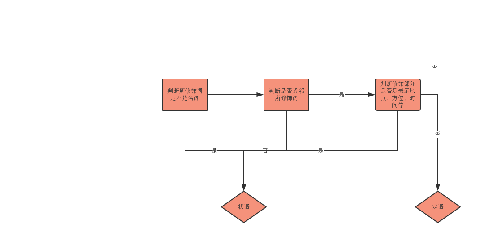

# 正确区分定语状语

+ 定语

  可以做定语的词

  + ==形容词==
  + 副词
  + 介词短语
  + ==从句-定语从句==
  + 动词ing
  + 动词ed
  + 动词 to do

  定语只能在修饰词的前面或后面，位置相对固定

+ 状语

  可以做状语的词

  + ==副词==
  + 介词短语
  + ==从句-状语从句==
  + 动词ing
  + 动词ed
  + 动词 to do
  
  状语位置比较随意，可以放在句首、句尾或句中

​		

