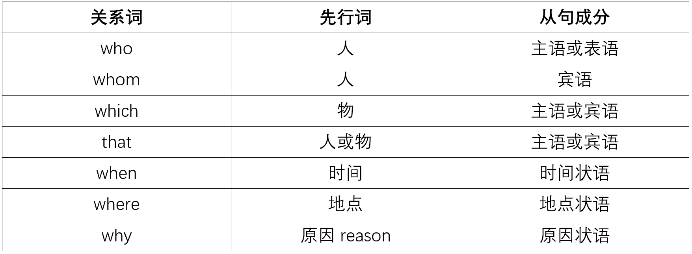
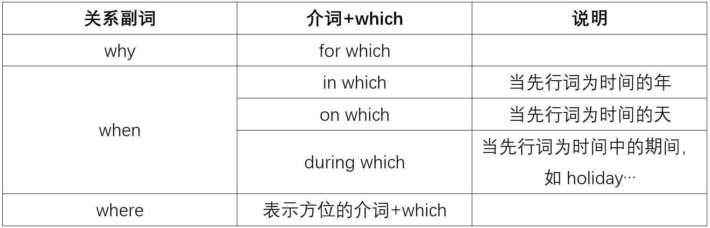

# 从句

## 1.名词性从句

+ 在句中充当名词作用的从句叫名词性从句，它包括主语从句、宾语从句、表语从句和同位语从句

+ 名词性从句使用**陈述句**语序：引导词+主语+谓语

+++

### 引导词（连接词）

#### 连词

**连词在从句中不做成分，连词一共有5个：that、whether、if、as if、as though**

+ that

  + 本身无意义，不充当从句中的任何成分

  + that省略的情况：

    1. 定语从句中做宾语
    2. that引导宾语从句时
    3. that引导表语从句时
    4. 主语从句中it做形式主语，that从句置于句末时

  + that不可省略的情况：

    1. 定语从句中做主语

    2. 由that引导主语从句放句首时

    3. that引导同位语从句时

    4. 宾语从句中

       + it做形式宾语，真正的that宾语从句中that不可以省略

       + 一个句子有两个或多个并列的宾语从句时，引导第二个和以后几个句子中的that不可以省略

       + 与动词相隔的宾语从句，不可以省略

       + that引导的宾语从句放在句首时，不可以省略

+ whether和if

  + 均表示“是否”表明从句内容的不确定性

  + whether从句中不能有否定式，而if可以

    I don’t care if he doesn’t come.

  + 只能用whether的情况

    1. whether引导主语从句放在句首时，只能用whether，用it形式主语不算

    2. 引导表语从句

    3. whether从句作介词宾语

    4. whether. . .or not, (whether or not不算)

    5. 引导同位语从句

    6. 后接不定式

    7. 为强调宾语从句而放到句首时

    8. 在discuss之后

+ as if、as though

  均表示“好像”，“似乎“

#### 连接代词（引导代词）

**在从句中做充当代词作主要成分：主、表、宾**

 what/whatever, who/whoever, whom/whomever, whose , which/whichever (9个)

#### 连接副词（引导副词）

**在从句中充当副词作状语**

 when/whenever, where/wherever, how/however, why,because (8个)

#### 连接词选择

+ 从句成分完整用连接副词，不完整用连接副词
+ 具体选择根据连接词含义

### 主语从句

+ 避免头重脚轻常用形式主语it代替主语从句作形式主语放于句首，而把主语从句置于句末。主语从句后的谓语动词一般用单数形式

+ **主句动词**用来表示惊奇、不相信、惋惜、理应如此(necessary、important、natural、strange、suggested、requested、proposed、desired等)等语气时，谓语动词要用虚拟语气"(should) +do"

  It is important that every member (should) inform himself of these rules. 

  重要的是每个成员知道这些规则

+ It 作形式主语和it引导强调句形式一样都是it is ... that...，注意区分

  **注意：形式主语连词不一定非要是that，强调句连词必须是that**

+ if 不能引导主语从句，但当it做形式主语，主语从句放在句末时，if, whether均可

+ 主语从句不可位于主句句首的情况

  1. if 引导的主语从句

  2. It is said/reported/learned…结构中的主语从句

     **据说，据报道...**

     It is said that President Jiang will visit our school next week.

  3. It happens/occurs…结构中的主语从句

     It occurred to him that he failed in the examination.

  4. It doesn’t matter how/whether …结构中的主语从句

     It doesn’t matter whether he is wrong or not.

  5. 复合句是疑问句时，主语从句不可在句首

     Is it likely that it will rain in the evening?

### 表语从句

+ if不能引导表语从句，只能用whether来引导

### 宾语从句

+ 宾语从句应该特别**注意主句和从句之间的时态问题**

+ 宾语从句也可以有形式宾语

+ 否定性宾语从句中，要把上述主句中的动词变为否定式，即将从句中的否定形式移到主句中

  We don't think you are here. 我们认为你不在这

+ 后面不能接that从句的动词有：condemn谴责，判刑、force强迫、take拿走、forgive原谅、dislike不喜欢、refuse拒绝、let、 like、love、help、admire羡慕、allow、celebrate、cause

  **注：以上动词后不能接that从句，但可以用不定式，动名词做宾语**

### 同位语从句

+ 同位语从句通常由that引导

+ 同位语从句与定语从句的区别

  1. 定语从句中的that既代替先行词，同时以在从句中作某个成分(主语或宾语)，而同位语从句中的that是连词，只起连接主句与从句的作用，不充当句中任何成分。

  2. 定语从句是形容词性的，其功能是修饰先行词，对先行词加以限定，描述定的性质或特征；同位语从句是名词性的，其功能是对名词进行补充说明

  The news that he told me is that Tom would go abroad next year.(他告诉我的消息是汤姆明年将出国。)(第一个that引导的从句是定语从句，that在从句中作宾语)

  The news that Tom would go abroad is told by him.(汤姆将出国的消息是他讲的。)(同位语从句，that在句中不作任何成分)

## 2.形容词性从句（定语从句）

+ 先行词是**名词或代词**
+ 在句中充当形容词作用

****

### 关系代词

关系代词有：who、whom、which、that、**as**、**whose**

+ 关系代词前面要有先行词
+ 在定语从句中做主语/宾语或表语
+ 否则关系代词前面要有介词

### 关系副词

关系副词有：when、where、why

+ 引导词在从句中做状语

### 关系词可以省略的情况

+ 关系词在从句中作宾语、表语、宾补
+ 先行词是reason
+ 先行词是way

### 关系词不可省略

+ 关系词在从句做主语
+ 搭配介词时
+ 非限定性从句

### 选择引导词

1. 如果从句缺少主干成分，引导词在关系代词中选择，不缺主干成分在关系副词中选择

   

**说明**

1. as

   + 放于句首的用法：

     ​	As+is\was+done(know,reported,said,estimated)+逗号

      = it is/was done(know,reported,said,estimated) that+句子

     ​	据报道/众所周知/据说...

     ​	as is often the case

     ​	像往常一样，情况往往是这样

   + 放于句中的用法

     先从词被such或the same修饰形成such...as..，the same...as..

2. whose

   + whose后面必须加名词

   + whose + n

      = the + n + of + which

      = of + which + the + n

     I like to study in this school, **whose faculty and facilities** are top-notch.

     I like to study in this school, **the faculty and facilities of which** are top-notch.

     I like to study in this school, **of which the faculty and facilities** are top-notch.

     我喜欢在这所学校念书，它的师资和设备均是一流的。

   + **当选项中出现whose时应该优先考虑whose再考虑其他选项**

   + 先行词既可以是人也可以是物

3. 只能使用that情况

   + 先行词是不定代词或被不定代词修饰
   + 先行词被最高级、序数词、the only或the very修饰
   + 先行词并列既有人又有物
   + 主句是以who/which开头的疑问句时

4. 不能使用that情况

   + 介词之后不可使用

   + **非限定性定语从句(关系词前面有逗号)不可使用**

     除了that外其他关系词都可以引导非限制性定语从句，使用方法与限制性定语从句几乎一样，只有一点不同：which可以指代逗号前整句话

关系副词=介词+which

#### "介词+关系代词(which/whom)"引导定语从句

1. 介词可移至从句句尾时，关系代词可以省略

   ​	He is a man **with whom** I enjoy working.

    = He is a man **whom** I enjoy working **with**.

    = He is a man I enjoy working with.

2. 先行词是人用whom，先行词是物用which；**介词的选择**主要根据以下情况:

   + 根据先行词

   + 根据**定语从句中的谓语动词**确定介词，其动词与介词搭配，构成动词短语

     Is this the car for which you paid a high price? (pay for)

     这是你花大价钱买的车吗？

     **注意：从句谓语动词的介词提前是十分不提倡的**

   + 根据**定语从句中的形容词**确定介词，其形容词与介词搭配，构成形容词短语

     The two things about which Karl Marx was not sure were the grammar and some of the idioms. (be sure about)

     马克思没有把握的两件事是:语法和习惯用法.

   + 根据**定语从句修饰的先行词**确定介词，其先行词往往是表示时间、地点、原因、方法、工具等的词，它们与介词之间有一定的联系.当"介词＋关系代词"在定语从句中充当时间、地点、原因状语时，可分别用when, where, why替换

     I'll never forget the day on which (= when )I joined the army. 

     我永远也忘不了我参军的那一天.

   + 根据**句子的意思**确定介词.有些句子，先行词完全一样，定语从句中谓语动词不是由固定的动词短语构成的，这时，要根据句子所要表达的意思，选用不同的介词

     This is the pilot for whom I bought a camera. (意思是:I bought a camera for the pilot. )这就是我给他买相机的那位飞行员.

3. 介词若与从句中的动词词组有关，可前置于关系代词前，也可置于动词后，但若此介词与动词为固定词组，则此介词一般不前置.例如:

   ​	Yesterday we paid a visit to the house in which LuXun lived.

    = Yesterday we paid a visit to the house which LuXun lived in.

   昨天，我们参观了鲁迅的故居.

   This is the very pen that I'm look for. (look for为固定词组，则介词for不可前置.)

   那就是我正在找的那支钢笔.

4. 限定性定语从句中，介词前置时，关系代词不能用that，且不能省略；若介词后置，则可以用that，也可以省略

   ​	This is the school in which I studied 3 years ago.

    = This is the school(which / that)I studied in 3 years ago.

   这就是三年前我学习的那所学校.

5. 表示所属关系时，介词应用of，关系代词为which / whom, 即n. + of + which / whom，可转换为whose+ n.

   ​	He lives in a room, the window of which faces west.

    = He lives in a room, whose window faces west.

   他住的房间，窗子向西开着.

   ​	The child was saved by a man, the name of whom was not known.

    = The child was saved by a man, whose name was not known.

   这个孩子被一位不知姓名的男子所救.

6. 表示整体中的一部分或……中最……的，介词一般也用of.

   The Greens have two daughters, both of whom are college students.

   格林夫妇有两个女儿，她们都是大学生.

   不要混淆:The Greens have three daughters，and two of them are students.

   China has many rivers, the longest of which is the Yangtze River.

   中国有众多河流，最长的是长江.

### 限制性定语从句和非限定性定语从句

**非限制性定语从句**

+ 先行词为专有名词或独一性名词（father，mother等）

+ 关系代词和关系词之间一定要有逗号，如若将非限定性定语从句放在句子中间，其前后也都需要用逗号隔开

+ 非限制性定语从句不再是对名词进行限制，而是**补充说明**，即使去掉主句意思仍然清楚完整

+ 非限定性定语从句中，**不能用that**

+ 非限制性定语从句的翻译并不是"...的"，而是作为一个独立部分与主句分开翻译

  I've invited Jim, who lives in the next flat. 

  我邀请了吉姆，他就住在隔壁

+ 非限制性定语从句中先行词一般不省略

**限制性定语从句**

+ 先行词为一般名词，定语从句是对先行词的限制，翻译成"...的"
+ 先行词在特定情况下可以省略

**对比**

两种定语从句含义完全不同

I have a sister who is a doctor. 我有一个做医生的姐姐。(姐姐不止一个)

I have a sister, who is a doctor. 我有一个姐姐，她是当医生的。(只有一个姐姐)

### 定语从句的主谓一致

+ 先行词是"one of + 复数形式"时，谓语动词应用复数形式；而当one之前有the 或the only修饰时，谓语动词应用单数形式

## 3.副词从句（状语从句）

副词从句又叫状语从句，在复合句中起状语的作用，用于修饰主句中的谓语动词、形容词和副词等。状语从句一般**由连词引导，连词不充当句子成分，只起连接作用**。状语从句也可以有短语引起，特殊情况也可以不需要连词而直接和主句连接起来。副词从句可放在句首或句尾，位于句首时，一般要用逗号与主句隔开，位于句尾时，一般不予主句隔开。根据意思上的不同，状语从句可以表示时间、地点、原因、条件、目的、结果、让步、比较和方式等。

### 1.时间状语从句

常用引导词如下：

| 连词                    | 含义               | 连词                 | 含义         |
| ----------------------- | ------------------ | -------------------- | ------------ |
| before                  | 在...之前          | directly             | 一...就...   |
| by the time             | 截止...            | after                | 在...之后    |
| since                   | 自...以来          | till/until           | 直到...      |
| when/while/as           | 当...的时候        | each time/every time | 每次         |
| the moment              | 立刻，马上         | no sooner...than...  | 一...就...   |
| once                    | 一旦...就...       | instantly            | 一...就...   |
| as soon as              | 一...就...         | immediately          | 一...就...   |
| hardly...when...        | 一...就...         | scarcely...when...   | 一...就...   |
| by now                  | 到目前为止；到如今 | ever since           | 从那时到现在 |
| from now on             | 从现在开始         | from then on         | 从那时起     |
| whenever/no matter when | 无论何时           | ...                  | ...          |

#### 同义词辨析

1. till, until直到...、not…until 直到...才...

  + until/till引导时间状语从句用于肯定句时，主句的动词是延续性动词,表示主句动作或状态一直**持续到从句所表示的时间才结束**
    We waited until he came. 直到他来，我才买了这本书。

  + 用于否定句时，主句谓语动词是非延续性动词，从句为肯定，表示主句动作或状态一直**持续到从句所表示的时间才开始**

    I didn’t buy this book until he came. 直到他回来我才买了这本书。

  + till不可以置于句首，而until可以

    Until you told me I had no idea of it. 知道你告诉我我才知道这件事。

  + not…until句型中的倒装和强调说法：

    Not until he came did I buy this book. 直到他回来我才买了这本书
    It was not until he came that I bought this book. 直到他回来我才买了这本书

2. when，while和as：当...时

  + when引导的从句的谓语动词**可以是延续性的动词**，又可以是瞬时动词。并且when有时**表示“就在那时、突然”**

    When she came in, I stopped eating.

    她进来时，我停止吃饭。(瞬时动词)

    When I lived in the countryside, I used to carry some water for him.

    当我住在农村时，我常常为他担水。(延续性的动词)

  + while引导的从句的谓语动作**只能是延续性的**，并强调主句和从句的动作同时发生(或者相对应).并且while有时还可以**表示对比**

    While my wife was reading the newspaper, I was watching TV. 

    (was reading是延续性的动词，was reading和was watching同时发生)

    I like playing football while you like playing basketball. 

    我喜欢踢足球，而你喜欢打篮球。(对比)

  + as表示“一边……一边”，as引导的动作**可以是延续性的动作**，一般用于主句和从句动作同时发生；**as也可以强调“一先一后”**
    We always sing as we walk.我们总是边走边唱。(as表示“一边……一边”)
    As we was going out, it began to snow.
    当我们出门时，开始下雪了。(as强调句中两个动作紧接着先后发生，而不强调开始下雪的特定时间)

3. before、after和since
   
    + before，after主句一般是过去完成时
    + since主句一般是现在完成时
    
4. as soon as、hardly/scarcely...when、no sooner...than...、instantly/immediately：一...就...

5. by the time 截至...

    从句一般现在时，主句将来完成时；从句一般过去时，主句过去完成时

#### 时态问题

+ 在时间状语从句中，不能用一般将来时、过去将来时态或将来完成时，而要用相应的一般现在时态、一般过去时或现在完成时来代替

### 2.地点状语从句

常用引导词如下：

| 连词            | 含义      | 连词       | 含义              |
| --------------- | --------- | ---------- | ----------------- |
| where           | 在...地方 | anywhere   | 无论哪里          |
| wherever        | 无论哪里  | everywhere | 每一...地方，到处 |
| no matter where | 无论哪里  |            |                   |
|                 |           |            |                   |

### 3.条件状语从句

常用引导词如下：

|       连词        |     含义     |    连词    |     含义      |
| :---------------: | :----------: | :--------: | :-----------: |
|        if         |     如果     |   unless   |     除非      |
|      only if      | 只有...才... |  if only   | 要是...就好了 |
| on condition that |     只要     | as long as |     只要      |
|     provided      |     只要     |            |               |

1. only if：主句要用半倒装结构

### 4.让步状语从句

常用引导词如下：

| 连词            | 含义             | 连词      | 含义             |
| --------------- | ---------------- | --------- | ---------------- |
| though          | 尽管、即使、虽然 | although  | 尽管、即使、虽然 |
| even though     | 尽管、即使、虽然 | even if   | 尽管、即使、虽然 |
| while           | 尽管、即使、虽然 | as        | 尽管，强调...    |
| no matter who   | 无论是谁         | whoever   | 无论是谁         |
| no matter what  | 无论什么         | whatever  | 无论什么         |
| no matter when  | 无论何时         | whenever  | 无论何时         |
| no matter where | 无论哪里         | wherever  | 无论哪里         |
| no matter which | 无论哪一个       | whichever | 无论哪一个       |
| no matter how   | 无论如何         | however   | 无论如何         |

1. "尽管、即使、虽然"：后面主句都不能加but
2. no matter xxx-只能引导让步状语从句，xxx-ever还可以引导名词性从句
3. whatever+名词；however+形容词/副词
4. while引导让步状语从句时只能放在句首
5. as必须把强调的部分倒装扔到as前面

### 5. 原因状语从句

常用引导词如下：

| 连词            | 含义 | 连词           | 含义 |
| --------------- | ---- | -------------- | ---- |
| because         | 因为 | since          | 既然 |
| as              | 由于 | for            | 因为 |
| in that≈because | 因为 | now that≈since | 既然 |

1. because既可以强调原因本身，也可以回答特殊疑问句why的提问，还可以用在强调结构中"it is  ... because..."
2. since强调结果
3. as表示大家都知道的原因
4. for表示推断、猜测的原因，弱因果关系

### 6. 目的状语从句

常用引导词如下：

| 连词               | 含义       | 连词          | 含义       |
| ------------------ | ---------- | ------------- | ---------- |
| in order that+句子 | 为了...    | so that+句子  | 为了...    |
| in order to+v      | 为了...    | so as to+v    | 为了...    |
| lest               | 以防、万一 | for fear that | 以防、万一 |
| in case(that)      | 以防、万一 |               |            |
|                    |            |               |            |

+ so ... that...:如此...以至于...
+ lest、for fear that、in case(that)引导目的状语从句时从句谓语动词一般要用"should + 动词原形"的形式，表示虚拟

### 7.结果状语从句

常用引导词如下：

| 连词            | 含义              | 连词        | 含义             |
| --------------- | ----------------- | ----------- | ---------------- |
| so+adj/adv+that | 如此... 以至于... | such+n+that | 如此...以至于... |

### 8.比较状语从句

常用引导词如下：

| 连词                   | 含义            |
| ---------------------- | --------------- |
| as + adj/adv原级+as... | 和...一样...    |
| ...+比较级+ than+...   | ...比...adj/adv |
| the 比，the 比         | 越...越...      |
|                        |                 |

1. as ... as ...否定结构为: not as/so ... as...,翻译成不一样...，不如...

### 9.方式状语从句

常用引导词如下：

| 连词             | 含义           | 连词      | 含义 |
| ---------------- | -------------- | --------- | ---- |
| (just)as...so... | 如同...一样... | like      | 像   |
| as if            | 仿佛           | as though | 仿佛 |

## 4.注意

### wh-ever 和 no matter wh-的比较

很多小伙伴只知道：

no matter what=whatever

no matter who=whoever

no matter which=whichever

no matter whom=whomever

no matter where=wherever

no matter when=whenever

no matter how=however

**BUT，这种情况只有在状语从句中才成立**

No matter what weather it is, we will go to Beijing tomorrow.

=Whatever weather it is, we will go to Beijing tomorrow. 不管天气如何，我们明天都会去北京。

**除此以外，当no matter wh-遇到wh-ever，总是会败下阵。以下情形，就是只能用wh-ever，不能用no matter wh-**

1. 主语从句：Whoever comes here will receive a present. 到这的人都能收到一份礼物。

2. 宾语从句：He does whatever his mother asks him to do. 妈妈要他做什么，他就做什么。

3. 加强语气，含有“究竟”、“到底”之义：

   Whatever do you mean? 你到底是什么意思?

**因此，总结起来，只要能用no matter wh-，就一定能用wh-ever，反之却不成立。**