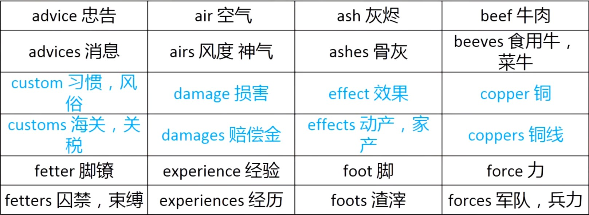
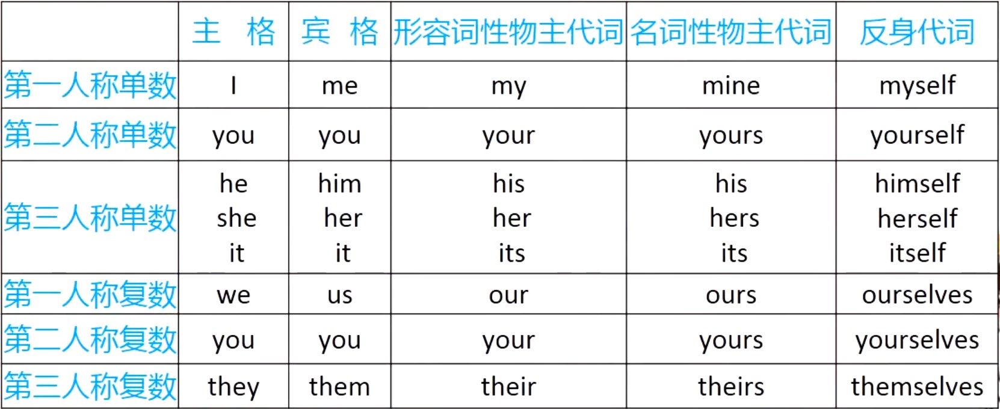
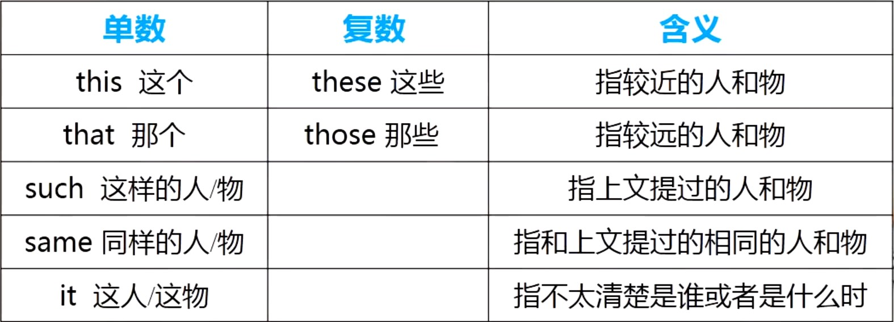
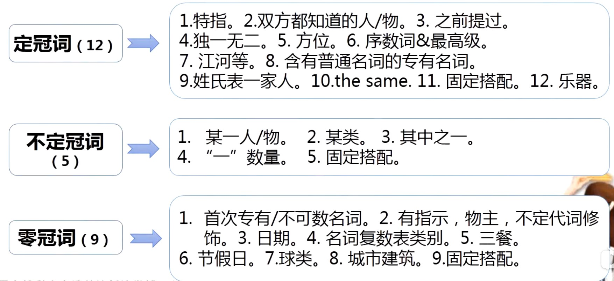
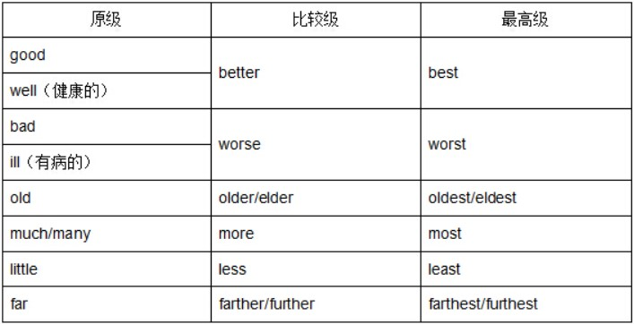
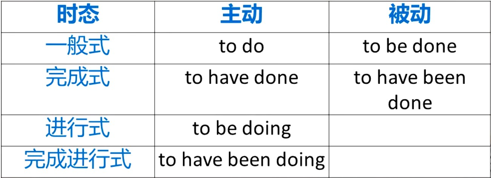

# 英语语法

## 十大词类

### 名词

**表示人、事物、地点或抽象概念的==名称==，名词就是表示名字的词**

**如篮球、北京、小李等**

#### 1.名词的分类

- 按名词含义来分

  + 专有名词 

     a.专有名词是个别的人、地、物、团体、机构等的专有名词 

     b.专有名词中实词的==第一个字母要大写==

     c.专有名词如含有普通名词的短语，必须用定冠词the

     ​		the Great Wall -- 长城

     d.姓氏名采用复数形式，表该形式一家人，一个家族

     ​		the Greens   --格林一家人，格林家族

  + 普通名词

     许多人或事物的共有名称

- 按可数/不可数来分

  + 可数名词
  
     可数名词是可以用==数词==进行计数的名词
  
  + 不可数名词
  
    不可数名词是不可以==数词==进行计数的名词

#### 2.单数变成复数

名词单数变成复数只会发生在==可数名词==身上

**规则性**

+ 在单数名词词尾加s

  如：map->maps,boy->boys,horse->horses,table->tables

+ s,o,x,sh,ch结尾的词加es

  如：class->classes,box->boxes,hero->heroes,dish->dishes,bench->benches

  少数以o结尾的词，变复数时只加s

  如：photo->photos,piano->pianos

+ 以辅音字母加y结尾的名词，变y为i，再加es

  > 26各字母分为元音和辅音，元音就是a,e,i,o,u，除了元音其他全部都是辅音

  如：family->families,city->cities,party->parties

+ 以f或fe结尾的名词，变f或fe为v，再加es

  如：shelf->shelves,wolf->wolves,life->lives,knife->knives

**不规则性**

[常见名词复数的不规则变化](常见名词复数的不规则变化.md)

**不可数名词一般没有复数形式，说明其数量要用有关==计量名词==**

如：a bag of rice -> two bags of rice

​		a piece of paper -> three pieces of paper

​		a bottle of milk -> five bottles of milk

#### 3.名词所有格

表示所属关系，相当于物主代词，翻译出来就是==...的==，我的，你的，小明的...

在句中作定语、宾语或主语

##### 变化规律

+ 表示==人==或其他==有生命==的东西的名词常在词尾加==’s==

  如：Children’s Day 儿童节

  ​		my sister’s book  姐姐的书，我姐姐==的==书

+ 以s或es结尾的复数名词，只在词尾加==’==

  如：Teachers’ Day 教师节，教师==的==节日
  
+ 有些表示时间、距离以及世界、国家、城镇等无生命的名词，在词尾加==’s==

  如：today’s newspaper 今天的报纸

  ​		ten minutes’ break 十分钟的课间休息

  ​		China’s population 中国的人口

+ 无论表示有生命还是无生命的东西的名词，一般均可用介词of短语来表示所有关系

  如：a fine daughter of the Party 党的好女儿

  ’s = of

  一般习惯有生命的用’s方式，无生命的用of方式

+ ’s还可以表示某人的家或某个店铺

  如：my aunt’s 我阿姨家

  ​		the doctor’s 诊所

+ 两个人共有某物时，可以采用A and B’s的形式

  如：Lucy and Lily’s bedroom  Lucy和Lily共同的卧室

+ 双重所有格：“of+名词所有格/名词性物主代词”

  在表达==...的之一==时要用双重所有格

  如：a friend ==of my== father’s  (friends)我父亲的==朋友中其中==一位朋友

  ​		a friend ==of mime== 我的一位朋友

  ​		My father’s friend’s friend  我父亲朋友的朋友

  ​		a friend of My father’ friend’s  我父亲朋友的朋友

#### 4.主谓一致

> 主语：是句子所要说的人或物，回答是“谁”或者“什么”
>
> 谓语：说明主语的动作或状态，回答“做（什么）”
>
> 所谓主谓一致，就是主语和谓语保持一致，谓语形式会随着主语的单复数，人称等跟着变化，如I用am，you用are，is跟着he,she,it

**主谓一致只会出现在句子中出现主语和谓语的情况，而谓语只能是动词或动词短语，所以主谓一致也就是对==动词==的变化**

+ 主语是可数名词单数或不可数名词，谓语动词用单数形式

  如：The computer ==was== a great invention 计算机是个了不起的发明

  ​		The water in the glass ==is== very cold  玻璃杯里的水很冷

+ ==集体名词==作主语

  如family,class,team,group,row,police,school等

  + 表示整体概念，谓语用单数形式

    Class Three ==is== a very good class  三班是一个好的班

  + 表示其中的所有成员，谓语用复数形式

  Class Three ==hava== a map of China 三班(学生)有张中国地图

+ Chinese,Japanese,fish,sheep,people等(单复数一致)表示单个时谓语用单数，表示许多时，谓语用复数

    There is ==a== sheep in the yard  院子里有只绵羊

    There are ==some== sheep in the yard  院子里有一些绵羊

+ 有s结尾，但不是复数，谓语用单数

    如：news  新闻，消息

    The ==news== is very exciting 这个消息令人兴奋

+ glasses,shoes,socks,trousers,gloves等名词常以复数形式出现，谓语用复数

    The trousers ==are== very cheap and i want to take them 裤子很便宜，我想买
    
+  a lot of

    + 跟名词复数时谓语用复数形式

    + 跟不可数名词时谓语用单数形式

      A lot of students are playing baseball now 现在许多学生在玩棒球

      A lot of time was wasted on that work  这项工作浪费了很多时间

+ and

    + 连接两个名词做主语时，谓语多用复数

    + 但两个名词构成一个==整体事物==时，谓语则用单数

      The teacher and his son are picking apples now 老师和他的儿子现在正在摘苹果

      Fish and chips is very famous food  鱼和薯条是非常有名的食物  Fish and chips在国外算是小吃名，在一起就是一个东西
    
+ there be就近原则

    There is a table and four chairs in the room.

+ 用both...and...连接两个事物做主语时，谓语一般用复数

    Both you and i ==are== required to be here tomorrow  你和我都必须明天在这里

+ 主语中有with的短语时，谓语单复数由with之前的人物决定

    ==A woman== with a 7-year-old child ==was== standing at the side of the road  一名7岁儿童的女子正站在路边

+ either...or...或者neither...nor...连接两个人物作句子主语时，谓语就近原则

    Either you or he is right.  你或他有一个是对的。

    Neither you nor I am going there.  你和我都不去那儿。

+ 表示一段时间或长度概念的复数名词做主语时，谓语一般用单数

    Two months is not a short time. 两个月可不短

    Two thousand kilometers is quite a long distance. 两千公里是相当长的距离。

+ 主语中含有half of.../(three quarters) of .../all (of) the ...等词语时，谓语的单复数由名词确定

    Over three quarters of the information on the Internet is in English. 互联网上超过四分之三的信息是英文的。

    A third of the students were playing near the lake. 三分之一的学生在湖边玩耍。

#### 5.单复数意义不同的名词

#### 6.名词相关链接

[主谓一致就近/远原则](主谓一致就近远原则.md)

### 代词

**用来==代替名词==的词，如，他们、我们、你、我、他等**

#### 人称代词

人称代词==代替人和事物==的名称，分主格和宾格两种形式

1. 主格：句中作主语，表语

   Are they from Brazil?  他们来自巴西？

   Where have they gone?  他们去哪儿了？

   It's he!  是他！

2. 宾格：用来作及物动词或者介词的宾语

   Who teaches you English this year?  今年谁教你英语？

   We often write letters to her.  我们经常给她写信。

3. 人称代词作表语或放比较状语从句连词than或as之后，主格形式宾格形式都可用

   -Whos is it？

   -It's I/me

4. 人称代词顺序：you->he->I

   当句中出现多个人称时，描述顺序为第二人称，第三人称，第一人称

   -Who will go there?

   -You and me.

5. 代词it

   + 指人/指物

   + 表示“时间、天气、温度、距离、情况”等含义

   + 作形式主语/宾语：替代作主语或宾语的不定式、动名词或名词性从句

     -What's the weather like today"

     -It's fine.

#### 物主代词

1. 形容词性物主代词

   作名词的修饰语，==后加名词==

   Is that your umbrella?  那是你的雨伞吗？

   I often go to see my aunt on Sundays.  我经常在星期天去看阿姨。

   They are their books.

2. 名词性物主代词

   **名词性物主代词=形容词性物主代词+名词**

   ==相当于名词==，既代替事物又表明所属关系

   在句子中作主语、宾语或表语

   后面==不可以跟名词==

   This is your cup ,but where is mine?  这是你的杯子，我的呢？

   Your classroom is very big,but ours is rather small.  你的教室很大，但我们的教室很小。

3. 双重所有格

   双重所有格：of + 名词性物主代词

   A friend of mine came to see me yesterday.  我的一个朋友昨天来看我。

   My friend came to see me yesterday.  我的朋友昨天来看我

####  反身代词

​	**反身代词，表示"...自己"**

​	用来代替我自己，他自己，你们自己..等各种“自己 ”的词

+ 作宾语

  放在动词后面

  反身代词在句子中==作宾语==表示反射。(指一个动作回到该动作执行者本身)

  Don't play with the knife , you might ==hurt yourself== 不要玩刀，你可能会==伤到自己==

+ 做同位语

  在句子中做同位语表示强调(即用来强调名词或代词)

  The story itself is good. Only he didn't tell it well.  故事本身很好。 只有他没说好。

####  指示代词

**指说明进出或远处、上文或下文、以前或现在的人或事物**

+ 指示代词可以作主语、宾语、表语、==定语==

####  关系代词

**用来==引导定语从句==的代词叫关系代词**

关系代词有who,which,that,whom等

在从句中担任一定的成分

起连接作用

The  student who is drawing a picture is in Grade One. 画画的学生在一年级。

+ 关系代词who/whom指人

  Do you know the man who is wearing a red hat?

  你认识哪个带着红帽子的男人吗？

+ 关系代词which指物

  Have you found the book which you lost several days ago?

  你找到几天前丢失的那本书了吗？

+ 关系代词that既可指人也可指物

  Can you see the man/dog that is running along the river bank?

  你看得见顺着河跑的男人/狗了吗？

#### 连接代词

**连接代词：用来引导宾语从句、主语从句或表语从句(名词性从句)的连接词称连接代词**

​	常见连接代词主要有：what(什么),who(谁),whom(谁的),which(哪个),whose(谁的)

####  疑问代词

**疑问代词：用来提出问题的代词成为疑问代词**

who,whom,whose,what,which,whoever,whatever,whichever,how long ,how much...都是疑问代词

+ 疑问代词用于提疑问句，虽然个别词和从句引导词一样，但二者之间应该分清，没有关系

+ 疑问代词不分单复数，视它所替代的人或事物决定单复数，但是通常用复数；如果修饰名词，则以名词的单复数为准

  Who is/are in that playhorse?谁在游戏房里？

  What colors do they have? 他们有哪些颜色？

####  不定代词

​	**不定代词：代替或修饰不特指的人或事物的代词叫不定代词，在句中作主语宾语表语定语和状语**

1. 单数

   some,any,no,none,each,every,one,either,neither,so,the other,another

2. 不可数

   much,little,a little ,all

3. 复数

   many,few,a few,ones,both,others,the others

4. 复合不定代词

   + something 某事，someone 某人
   + somebody 某人，anything 任何事
   + anyone 任何人，anybody 任何人
   + nothing 没事，nobody 没有人，no one没有人
   + everything 一切，everyone 每个人，everybody每个人
   
5. 易混词辨析
   
   + some和any
   
     + some
   
       肯定句中，表"几个""一些""某个"；
   
       疑问句中，表建议，请求希望得到肯定回答
   
       可修可数或不可数名词
   
     + any
   
       疑问句或否定句中，表"任何一些"，"任何一个"
   
       肯定句中，意思是"任何的"
   
       可修可数或不可数名词
   
   + no和none
   
     + no
   
       作定语，表"没有"，修可数名词(单数或复数)或不可数名词
   
       no+名词
   
     + none
   
       只单独使用，在句中可做主语、宾语、表语，意思是"没有一个人(或事物)"，表复数或单数
   
       none不可加名词
   
   + all和both
   
     + all:指三者或三者以上的人或物，代替或修饰可数名词；或不可数名词
     + both:指两个人或物，用来代替或修饰可数名词
   
     all和both在句子中做主语、宾语、表语、定语等
   
     + all/both + of the +名词(复数)，其中的of可以省略
   
       All (of) (the) boys are naughty  是男孩都调皮
   
   + every和each
   
     + every
   
       形容词，只做定语修饰单数名词，“每一个”，表整体概念
   
     + each
   
       形容词/代词，可作主语/宾语/定语等，“每个”或“各个”，表单个概念
   
   + either和neither
   
     + either
   
       "两个中间的任何一个"
   
     + neither
   
       是either的否定形式，"两个都不"
   
     neither和either在句子中可作主语、宾语和定语等，都用做单数
   
   + other，the other和another
   
     + other:"另一"、"其余"，有复数形式。作主、宾和定。"不同种类另一个"
     + another:"另外"、"又一个"，表示增加，作宾和定。"同种类另一个"
     + the other:只有两个是用the other."one ... the other"固定搭配
   
     You hava had several cakes.Do you really want another one?  你吃了好几块蛋糕，你真的想再吃一块(仍是蛋糕)吗？
   
     This is one of your socks.Where is the other one?  这是你的一只袜子,另一只在哪里？
   
     I have eaten 4 cakes,but I still want other. 我已经吃了4个蛋糕，但我还是要其他的(不是蛋糕)。
   
   + others和the others
   
     + others ："其余的人/物，指大部分"
     + the others:"其余的人/物，指全部"
   
     A few students are playing soccer while others are watching them.  一些学生在踢足球，而另一些学生在看他们足球。
   
     Two of the ten boys are standing and the others are sitting round them.  十个男孩中有两个站着，其余的坐在他们周围。
     
   + many和much
   
     + many "很多"，与可数名词复数连用
     + much "很多"，与不可数名词连用
   
   + few、little、a few、a little
   
     + few/little:"很少几个"、"几乎没有"，否定的意思
     + a few/a little:"有几个"、"有些"，肯定的意思
     + few/a few:与可数名词连用或替可数的事物
     + little/a little:与不可数名词连用或替不可数的事物
   
     He is very poor and he has little money.  他很穷，几乎没什么钱
   
     Don't worry .There is still a little time left.别担心，还有一点时间呢
   
     In that polar region there live few people.  在那个极地地区几乎不住人
   
     You can get a few sweets from him.  你可以从他那弄到一些糖果
   
   + somebody,something,anything,nothing,everything,everybody等符合不定代词在句子中当单数使用
   
     + something,somebody,someone一般用于肯定句中
     + anything,anybody,anyone一般用于疑问句、否定句和条件状语从句中
     + 修饰符合不定代词的定语，应放在他们的后面
   
   + a lot of, lots of , a number of , large numbers of , a great deal of ,plenty of "大量，许多"
   
     + a lot of, lots of , plenty of :既可以修饰不可数名词也可以修饰可数名词的复数形式
     + a number of / large numbers of :只修可数名词复数形式
     + a great deal of:只修不可数名词
   
   + none,no one,nobody
   
     + no one / nobody：指人，后不跟of短语，谓语用单数形式
     + none:指人也可指物，后可跟of短语，谓语可用单数也可用复数
   
     No one knows how he managed to get the ticket.  没有人知道他是如何获得这张票的。
   
     Nobody handed in his/their composition(s) yesterday.  昨天没有人交作文。
   
     None of my friends came to see me that day. 那天我的朋友都没有来看我。
   
#### 相互代词

​	**相互代词：表示互相关系的词叫相互代词**

+ each other,one another译"互相"，两者没有区别，可通用
+ 所有格形式each other's, one another's

We must help each other when we are in trouble.  我们身处困境时要互相帮助

They sat there without talking to ==one another== / ==each other==.  他们坐在那，互相都不说话

### 数词

   **表示数目或顺序的词，如：one,two,second...**

+ 分为基数词和序数词

+ 做句子中的主语、宾语、表语和定语

#### 基数词

**表示数目的词叫基数词**

一千：one (a) thousand

一万：ten thousand

十万：one hundred thousand

百万：one million

千万：ten million

亿：one hundred million

+ 百位与十位之间要加and；十万位和万位，亿位和千万位之间通常也要加and

+ 英语用千、百万等计数单位，大数字从右向左看，每隔三位划一逗号，倒数第一个逗号之前要用thousand，倒数第二个逗号之前要用million，倒数第三个逗号之前要用billion表示

+ hundred、thousand、million作数词单位时，不用复数，前面可以加上one、two...等其他数词。用作名词时复数表示"成...上...",后面必须要有of,前面可以加上some,many,several等词。

  five hundred  五百

  ten thousand   一万

  hundreds of 数以百计，成十上百

  thousands of 成千上万

例如：七百八十二亿四千万零八万四千七百六十九

写成数字：78240084769

从右到左分开：78,240,084,769

倒数第一个逗号之前要用thousand，倒数第二个逗号之前要用million，倒数第三个逗号之前要用billion表示

78 ==billion== 2 hundred and 40 ==million== 84 ==thousand== 7 hundred and 69

数字换成英语：Seventy-eight billion two hundred and Forty million Eighty-four thousand Seven hundred and Sixty-nine

#### 序数词

**表示顺序的数词叫序数词**

1000th ->one thousandth

1000000th -> one millionth

第703 -> the seven hundred and third.

第5480 -> the five thoudand four hundred and eightieth

+ 两位以上的序数词仅个位数部分用序数词，其余部分仍用基数词

  thirty-sixth 第三十六

+ 使用序数词时一般加定冠词the

  I'm in the third grade  我在三年级

+ 序数词作"几分之几",有复数形式

  1/5 -> one fifth

  2/3 -> two thirds

#### 数词用法归纳

1. 表示年份

   2002：twenty thousand and two

2. 表示日期

   12月1日：Dec.1s或 the first of December

3. 表示时刻

   5：15：five fifteen或a quarter past five

4. 表示编号

   Room 105: Room one 0 five

   Bus No.13 : Bus Number Thirteen

5. 小数读法

   5.7：five point seven

   0.16:zero point one six

6. "半"的表达

   1/2：half

   半小时：half an hour

7. 序数词前面加the时，表示顺序，加a/an表示“再一，又一”

   The third lesson is rather difficult  第三课相当难

   Shall we read the text a third time?  我们把课文读第三遍，好吗？

### 冠词

**用在==名词==前，帮助说明名词**

#### 定冠词

+ 用法

  1. 表示==特指==的人或事物

     The man with a flower in his hand is Jack  手上拿着一朵花的男人是Jack

  2. 指谈话双方都熟悉的人或事物

     Look at the blackboard,Lily 丽丽，请看黑板

  3. 复数前面提到过的人或事物

     There is a man under the tree.==The== man is called Robert  树下有个人，那个人叫罗伯特

  4. 表示世界上独一无二的事物

     The earth turns around the sun.  地球绕着太阳转

  5. 用在表示方向/方位的名词前面

     There will be strong wind to ==the south== of the Yangtze River.长江以南地区将会刮大风

  6. 在序数词和形容词最高级的前面

     Who is the first one to go?  谁第一个去？

     Of all the stars , the sun is the nearest to the earch. 在所有的恒星之中太阳离地球最近

  7. 用在江河、海洋、山脉等名称的前面

     I have never been to the Himalaya Mountains 我从来没有去过喜马拉雅山。

  8. 用在含有普通名词的专有名词的前面

     He is from the United States of america. 他来自美利坚合众国

  9. 用在姓氏之前表示一家人

     The greens are going to mount Emei next month.  下个月格林一家要去峨眉山。

  10. same之前一般用the：比较结构

      Lucy and lily look the same  露西和莉莉看上去长得一样。

  11. 固定短语

      at the same time  

      make the bed

      in the end

      all the time

  12. 乐器名称前面

      He began to play the violin at the age of 5 五岁时他开始拉小提琴。

#### 不定冠词

1. 不定冠词a/an 用在单数名词的前面
2. a用在辅音开头的词前面
3. an用在元音开头的词前面

+ 不定冠词a/an的5种用法

  1. 表示某一个人或物，但不具体说明何人或何物

     There is a dog lying on the ground.  有一只狗躺在地上

  2. 表示某类人或事物，以区别于其他种类

     A elephant is much stronger than a man

     大象比人强壮多了

     不能译为：一头大象比一个人强

  3. 表示某类人或事物中的任何一个

     He is a teacher of English  他是英语老师

  4. 表示“一”这个数量

     There is a table and four chairs in that dining-room   在那个餐厅里有一张桌子和四把椅子

  5. 固定搭配

     a bit  一点

     a little 一点

#### 零冠词

+ 使用零冠词的情况

  1. 专有名词和第一次使用不可数名词前通常不用。

     此处专有名词并不含普通名词

      China is a very large country.  中国是个大国

     Man needs air and water.  人类需要空气和水

  2. 名词前已有指示、物主或不定代词作定语时

     My pen is much more expensive than yours.  我的钢笔比你的昂贵多了

  3. 周名月名或季节名前一般不用。

     He was born on Monday February 18, 1995.  他出生在1995年二月十八日星期一。

     They usually plant trees on the hills in spring  春天他们通常在山上植树。

  4. ((第一次使用)复数名词表示人或物的类别。

      Men are cleverer than monkeys  人比猴子聪明

  5. 三餐饭前不用。

     We have breakfast at home and lunch at school  我们在家吃早饭在校吃午饭。

  6. 节、假日前一般不用。

     On Children s Day the boys often get presents from their  parents.  在儿童节, 这些男孩经常得到父母的礼物。

  7. 球类名词前不用。

     The children play football on Saturday afternoons.  孩子们星期六下午踢足球

  8. 城市的建筑物名称前不用

     They are now at Peoples cinema.  他们此刻在人民电影院。

  9. 一些习惯用语中不用

     (1)at /to/ from /out of /after /for school

     2)in /to/for /after class

### 形容词&副词

#### 形容词

**表示人或事物的==性质或特征==** **如good-好的，right-正确的，white-白色的，orange-橙色的**

+ 形容词定义

   用来说明或修饰==名词、代词==的词称为形容词

+ 形容词的句法作用

   作定语、表语以及宾语补足语。
   
+ 在句中的位置(4点)

   1. 多放名词之前;出现多个形容词修饰一个名词时，音节少的词放在音节多的词之前。

      a big yellow wooden wheel.  一个黄色的大木轮

   2. 作表语时放系动词之后

      The price sounds reasonable.  这个价格听起来算是合理。

   3. 作宾语补足语时放==宾语之后==。

       We must try our best to keep our environment clean.  我们必须尽力保持我们的环境清洁。

   4. 后置的两种情况:

      + 修饰复合不定代词时放在代词之后

        Something serious has happened to him.  他发生了严重的事故。

      + 与表示长、宽、高、重、老、距离”的词连用时形容词后置

        He′s 18 meters tall.  他身高1.8米。

+ 7组易混词辨析

   1. interested 5 interesting

      ① Interesting“令…感兴趣的”  本身有趣

      ② interested“对…感兴趣的”。对外感兴趣

      The man is very interesting and all the children like him.  这个人很有趣孩子们都喜欢他。

      I am interested in science.  我对自然科学感兴趣。

   2. good与well

      ①作定或表用good

      ②表“(身体)好”&作状时用well=fine

      Doing sports is good for us.(表语)

      Study well and make progress every day.(状语)

      -How are you?

      -I am very wel.(身体)

   3. nice与fine

      ①nice:表令人愉快的,可指东西、人物外表等。
      
      ②fine:指身体或天气好。
      
      Let' s go and share the nice cake.(东西)  我们去分享一下美味的蛋糕吧
      
      She is a nice girl.(人)
      
      What a fine day !(天气)
      
      He' s fine recently.(身体)
      
   4. too much与 much too
   
      ① too much:“太多的’,修饰事物数量,后加名词
   
      ② much too:“太过过分",修饰形容词或副词,后加形容词或副词
   
      I am full because i have had too much rice
   
      That coat is much too dear
   
   5. quick,fast与soon
   
      ① quick与fast:速度快。
   
      ②soon:时间快。
   
      After a quick breakfast he hurried to school leaving his bag at home (速度)
   
      A train is much faster than a bus.(速度)
   
      His father will be back to china very soon.(时间)
   
   6. lonely与alone
   
      ① lonely“孤独的,寂寞的”.强调主观感受
   
      ② alone“独自的,单独的.强调客观事实
   
      He lives alone but he doesnt feel lonely.  他一个人住，但他并不孤单
   
      He is a lonely person. You can not easily get on well with him他是一个孤独的人,你不能容易与他相处
   
   7. (7)living, alive, live, lively
   
      ① living:"活着的,现存的”,同死相反;“一模一样的,逼真的′ ; =lively  “强烈的,活泼的"
   
      ②live:指东西"活的"  = living“现场的”  “实况的”
   
      ③ alive:指人“活着的"。
   
      ④lively:有生气的,活泼的,可爱的,快活的;(色彩)鲜艳的;生动的、真实的。
   
      We have a living hope that you will succeed.“强烈的   我们希望你能成功
   
      Is she still alive?“(人)活着的”  她还活着？
   
      This is a live fish.“(非人)活着的”  这是一条活鱼
   
      She is as lively as a kitten.“可爱的”  她和小猫一样活泼
   
      He gave a lively description of the football match"生动的"  他生动的描述了足球比赛

#### 副词

**①修饰动词、形容词或副词** **②说明时间、地点、程度** **如：now,very,hero,often,quietly,slowly...**

+ 定义

   - 说明事情发生的时间、地点、原因、方式等含义;
   - 说明其它==形容词或副词程度==的词叫做副词。

+ 易混副词辨析

   1. too,also, either,nor “也”

        ①too:肯定句和疑问句的末尾,用逗号隔开

        ②also:用在肯定句中，谓语动词之前;

        ③ either:否定句末尾,用逗号隔开

        ④nor:否定句,句首,句子需要倒装
   
      Are you American, too?
   
      He is not happy and I am not happy, either
   
      He didnt watch the football game . Nor did I
   
      You can also find the market is very good
   
   2. sometimes, sometime ,some times, some time
   
      ① sometimes:“有时”用于一般现在时。
   
      ② sometime:将来的某时。
   
      ③ some times:“数次”。
   
      ④ some time:“一些时间”。
   
      Sometimes they go hiking in the mountains.(有时)
   
      I will stay here some time.(一些时间)
   
      I will meet your father sometime.(未来的某时间)
   
   3. farther与 further
   
      ①表地点、方向或距离时同义,更远、较远
   
      ② further还表更多、进一步、额外”等意思。
   
      They decided to go farther/ further the next day.“具体”
   
      This problem will be further discussed.“抽象
   
      Every one of them had their further studies after they left college  “抽象”
   
   4. most, mostly
   
      ①most:(形容词和名词)“大多数的,大部分的”;
   
      ​				(副词)“最,十分,很”
   
      ②mostly:(副词)“主要地、多半地、大部分地”
   
      I was at home most of the time when I was free
   
      This is the most exciting part of the film
   
      She is mostly out on Sundays
   

#### 形容词副词的原级、比较级和最高级

+ 规则变化

  1. 单音节和部分双音节形容词和副词,在原级的后面加上er,est构成比较级和最高级。
  2. 两个音节或两个以上的音节的在原级前加more,most
  
+ 不规则变化
  
  
  
+ 固定句型

  1. 同级比较

     + as...as, the same...as 与...一样(同级比较)

       出现形容词或副词时使用as..as，否则用the same .. as,the same ... as = the identical with

       She has written as many essays as her brother (has)

       她写的文章和她哥哥写的一样多。

     + no more... than 或 not...any  more than ...和... 一样不...(同级比较)

       The heart is no more intelligent than the stomach,for they are both controlled by the brain.
  
       心脏和胃都不聪明，因为它们都是由大脑控制的。
  
  2.  the more…, the more  越...越...   
  
     more and more... 越来越...
  
     As the internet becomes more and more commercialized,it is in the interest of business to universalize access- after all, the more people online, the more potential customers there are
  
     随着互联网日趋商业化,普及使用符合商家的利益--毕竟,在线的人数越多,潜在的客户就越多
  
  3. 表最高程度
  
     + 否定词+ more 十分，非常
  
       I can't agree with you more.
  
       我十分赞同你
  
     + no+ 名词 +more ... than 没有什么比...更，莫过于
  
       No tool is more powerful for understanding the natural world than the scientific method.
  
       没有任何工具比科学方法更能理解自然界。
  
     + more...than + anyone/anything else 比其他任何...都...，最...，没有比...更...
  
     + 跟人比用anyone,跟物比用anything
  
       He did more work this morning an anyone else.
  
     + nothing as ... as/nothing like 最；没有比...更
  
       Nothing in the present-day world is so popular as Internet
  
       当今世界中没有任何东西像互联网那样受欢迎
  
     + the only + 名词  最好的，独一无二的
  
       He is the only man for this study. 他是学习最好的.
  
  4. 表倍数
  
     + 倍数+as+形容词或副词原级+ as
  
       An ordinary subway train, approaching the station, can be twice as loud as the loudest jet
  
       接近车站的普通地铁列车的声音可能是最响的喷气式飞机的两倍
  
     + 倍数+名词+of
  
       The bridge is three times the length of that one.
  
       这座桥比那座长三倍.
  
     + 倍数+比较级+than
  
       This hole is three times deeper than that one.
  
       这个洞比那个洞深三倍
  
  5. (just)as…,so:“正如…所以”
  
     so后面的句子多用倒装结构
  
     Just as the soil is a part of the earth, so is the atmosphere
  
     就像土壤是地球的一部分一样，大气层也是如此
  
  6. not... so much as ...   与其....不如...
  
     “与其说A不如说B"或“是B,而不是A”
  
     not A so much as B
  
     not so much A as B
  
  7. more than
  
     + more than+动词或名词:“不仅是,不止是”
  
       They may teach very well, and more than earn their salaries, but most of them make little or no independent reflection on human problems which involve moral judgment。
  
       他们可以教得很好，而不仅仅是赚取薪水，但他们中的大多数人很少或根本没有对涉及道德判断的人类问题进行独立思考。
  
     + more than+数字:“多于...”
  
       The role of natural selection in evolution was formulated only a little more than 100 years ago, and the selective role OT environment In Shaping and maintaining the individual Is only beginning to be recognized and studied
  
       自然选择在进化中的作用仅在一百多年前才得以阐明，而环境在塑造和保持个体行为时的选释作用才刚开始被认识和研究
  
     + more than+形容词:“"非常”
  
       The USA remains more thar capable of holding Iraq down, while confronting North Korea and Iran-its next main targets
  
       美国在推翻伊拉克的同时完全还有实力可以与接下来的主要目标朝鲜和伊朗对抗
     
  8.  nothing more than:“只不过是”
  
     The individual TV viewer invariably senses that he or she is  nothing more than an anonymous, statistically insignificant part of a huge and diverse audience.
  
     美味电视观众总会觉得,在众多形形色色的观众当中,自己只不过是无足轻重的一小分子
     
  9. no less than /nothing less than：不亚于…,相当于…
  
     This alone demonstrates that the television business is not an easy world to survive in, a fact underlined by statistics that show that out of eighty European television networks,no less than 50% took a loss in 1989
  
     这一点就足以证明,要再电视行业里生存下来井非易事、统计数字尤其说明了这七事实一在80个欧洲电视网中,多大一般在1989年出现了亏损。
  
  10. more than...can:"简直不能”
  
      The beauty of the place is more than I can describe.
  
      这个地方的美丽超出了我的描述。
  
      The problem of the environmental protection is more than people can resolve.
  
      环境保护问题比人们可以解决的问题更多。
  
  11. "the+比较级...，the+比较级...":"越...，越..."
  
      The more trees we plant,the better it will be.
  
      我们种植的树木越多，它就越好。
  
      The harder you try,the greater you progress is.
  
      你越努力,你的进步就越大
  
  12. "one of the + 最高级+名词(复数)":"最...之一"
  
      谓语用单数形式
  
      One of the oldest houses has been burnt in a fire.
  
      最古老的房屋之一已被烧毁。
  
  13. 
  
      

### 动词

**表==动作或状态==** **如：am,is,are,have,see,play...** 动词是所有词类中最重要最难掌握的，它：

- 体现语法点(时态、语态、非谓语动词、虚拟语气、主谓一致)最多
- 动词会改变整个句子句意
- 动词变化最丰富

1. 动词的分类

   + 实义动词

     ①含实在的意义

     ②表动作或状态;

     ③在句中独立作谓语。

     They eat a lot of potatoes.

     I'm reading an English book now.

   + (连)系动词

     ①本身有一定的词义

     ②be动词&感官动词。

     His father is a teacher

     Twins usually look the same

   + 助动词

     ①本身没有词义不能独立作谓语只和主要动词一起构成谓语动词

     ②表否定、疑问、时态、语态等

     ③有人称、单复数和时态的变化

     ④[助动词是什么？为何动词需要帮助？](https://www.zhihu.com/question/23849233)

     He doesn't speak English

     We are playing basketball

   + 情态动词

     ①本身有意义,不独立作谓语,和动词一起构成谓语动词;

     ②情态动词没有人称和单复数的变化,有些情态动词有过去式.

     You can keep the books for two weeks.

2. 动词词形变化

   + 原形-->过去式-->过去分词

     | 原形      | 过去式 | 过去分词 | 原形 | 过去式 | 过去分词 |
     | --------- | ------ | -------- | ---- | ------ | -------- |
     | be(am,is) | was    | been     | lose | lost   | lost     |
     | be(are)   | were   | been     | make | made   | made     |
     | beat      | beat   | beaten   | put  | put    | put      |

3. 动词语法

   + 动词的时态

     |          | 现在时               | 过去时            | 将来时                      | 过去将来时                    |
     | -------- | -------------------- | ----------------- | --------------------------- | ----------------------------- |
     | 一般     | ask/asks             | asked             | shall/will ask              | should/would asd              |
     | 进行     | am/is/are asking     | was/were   asking | shall/will be asking        | should/would be asking        |
     | 完成     | have/has asked       | had asked         | shall/will have asked       | should/would have asked       |
     | 完成进行 | have/has been asking | had been asking   | shall/will have been asking | should/would have been asking |

   + 动词的语态

     主语是动作的执行者(即某人做某事),叫做==主动语态==

     主语是动作的承受着(即某人被做),叫做==被动语态==

     + 被动语态

       1. 构成

          ①构成:助动词be+动词的过去分词

          ②助动词be有时态、人称和数的变化。

          ③被动语态后的by短语有时可省去

       2. 被动语态的用法

          ①不知道谁是动作的执行者(即不知道谁做)时用被动语态,省略by短语。

          ②众所周知是谁做时,用被动语态,省略by短语

          ③强调动作的承受者,句尾加by短语。

          A man ==was killed== in the accident.

          This window ==was broken== yesterday

          Rice ==is also grown== in this place

          A railroad ==will be built== here in three years

          It ==was written== by lu Xun

          A pet dog ==is never killed== by its owner

       3. 主动语态改被动语态方法

          i.将主动语态的宾语改为被动语态的主语;

          ii.将主动语态的谓语动词改为“be+过去分词”结构

          iii.将主动语态的主语改为介词by之后的宾语,放在谓语动词之后(有时可省略)。

          + 双宾的被动语态

            His teacher gave him a dictionary

            a)把间接宾语改为被动语态的主语,直接宾语仍保留原位;

            \> He was given a dictionary by his teacher.

            b)把直接宾语改为主动语态的主语,间接宾语前要加介词to或for

            \>A dictionary was given to him by his teacher.

          + 加to

            感官动词和使役动词主动语句中没有to(do sth)，改为被动句就是to do

            不带to的动词不定式作宾语补足语的主动语态,改为被动语态时不定式前要加to

            The boss made the poor man work 12 hours a day

            \>The poor man was made to work 12 hours a day

          + 带复合宾语的动词

            一般把主动语态的宾语改为主语,宾语补足语在被动语态中做主语补足语。

            \>I paint the house white

            \>The house is painted white by me

          + 动词短语作谓语

            短语动词是不可分割的整体,改为被动语态时要保持其亮整性,介词或副词不可遗漏

            The girl ==takes good care of== her little brother.

            \>The girl's little brother ==is taken good care of== by her

       4. 非谓语动词(不能做谓语的动词)之不定式

          非谓语动词就是==不能做谓语的动词==，可以做谓语以外的成分，如：主语，宾语，表语，定语，状语，宾补

          谓语动词和非谓语动词都可以有主语，有宾语，有时态，有语态

          非谓语动词形式： to do(不定式) , ed(过去分词) ,ing(现在分词)

          + 动词不定式

            ①肯定

            分为带“to"(to do)和不带“to"(do)的动词不定式。

            ②否定:not不定式

          + 非谓语动词的不定式的时/语态

            

            + 时态

              1. 一般式

                 表示不定式的动作与谓语动词动作几乎==同时发生==

                 \> The news will not fail to surprise him.

                 \>I helped to repair the car.

              2. 完成式

                 通常表示动作发生在谓语动词之前

                 I am sorry not ==to have come== to your party last night

                 He seems ==to have finished== his homework

                 I am very happy ==to have helped== you.

              3. 进行时

                 表示不定式的动作正在进行,持续之中

                 The boys were discovered ==to be hiding== behind the door

                 It's nice ==to be lying== on the beach

                 The boss doesn 't like you ==to be always coming== late for work.

              4. 完成进行式

                 表示不定式的动作在谓语动作之前

                 到谓语动作发生时可能停止,也可能继续下去。

                 Tom seemed to have been reading a novel.

                 He is found to have been working for 4 hours.

            + 语态

              ①逻辑主语是动作的发出者,用主动

              ②反之,用被动。

              \>She asked the door to be closed.

              1.  there be句型-用主动表示被动

                 在 there be句型中,主语可用不定式修饰

                 句中主语是不定式的承受者,常用不定式的主动表示被动。

                 There is still a lot of work to do (to be done).

              2. too.to句型-用主动表示被动

                 用不定式主动代替被动

                 The stone is too heavy to move(be moved).

                 The stone is too heavy for me to move.

              3. “主语+系动词+形容词+不定式”结构-用主动表示被动

                 如果表语形容词说明的是主语的内在特征,用主动表被动。

                 The pencil is easy to write with.

                 The coffee is bitter to taste.

              4. 不定式+“动词+介词-用主动表示被动

                 如果不定式后面跟的是“动词+介词短语动词,介词不可省略。

                 You are pleasant to talk with.

                 The pen is hard to write with.

            + 不定式的句法功能

              1. 作主语

                 不定式作主语时,表示一个具体的,特定的行为。

                 谓语动词用第三人称单数形式

                 动词不定式作主语可位于句首;

                 当作主语的不定式是较长的短语是,我们通常使用it作形式主语,而将动词不定式置于句末
                 
                 To live means to create.
                 
                 To do that sort of thing is stupid.
                 
                 To learn a skill is very important for everyone in society.
                 
                 It is necessary for young students to learn a foreign language.
                 
                 为避免句子出现头重脚轻，所以一般用it作形式主语,动词不定式作实际主语
                 
                 动词不定式作实际主语句型：
                 
                 a)It is +adj. (+ for sb. /sth. ) to do sth.
                 
                 b)It's+adj.+of+sb.+不定式
                 
                 c)It+be+名词+不定式
                 
                 d)It takes sb. + some time + to do sth.
                 
              2. 做表语
              
                 主语和表语同为不定式时,通常主语表示条件,表语表示结果
              
                 To see is to believe.
              
                 作表语常用于以下结构:
              
                 My wish/job/aim/ goal is+不定式
              
                  The next step/important thing/problem/measure is +不定式等
              
                 My wish ==is to be== a teacher.
              
                 My goal ==is to pass== the college entrance examination.
              
                 Your job ==is to type== the papers in the office.
              
                 The next measure ==is to stop== the river from being polluted.
              
              3. 作宾语
              
                 常见的使用动词不定式作宾语的动词有
              
                 agree, choose, decide, hope, fail, wish, refuse, expect,manage, plan, intend, pretend, promise, offer, afford,demand, arrange等。
              
                 常接"疑问词+不定式"作宾语的动词有:
              
                 decide, know, learn ,remember, see, settle ,think...
              
                 They decided ==to build== a highway between these two cities.
              
                 She offered to help me when I was in trouble.
              
                 He promised not to tell anyone about it.
              
                 注意：
              
                 + 当作宾语的不定式是较长的短语,常用it作形式宾语,而把真正的不定式放到句未去.
              
                 + 常用动词有 believe, think, consider,find, feel, make等。
              
                 + 构成句型“动词+it+adj./n+ to do sth”,其中使用it作形式宾语,真正的宾语动词不定式置于句末。
              
                   I think ==it== necessary for us ==to have a good rest== after the long work.
              
                   I find ==it== difficult ==to understand== him.

              
              4. 作宾补
              
                 逻辑主语是它前面的宾语。
              
                 \> The doctor advised her not ==to eat== too much sugar
              
                 \>I wish you ==to go== to the meeting with me.
              
                 \>I persuaded him ==to give== up smoking
              
                 \>She asked me ==to stay== here
              
                 注意:
              
                 有一类表见解,看法的动词,后常接to be型不定式作宾补,to be可以省略
              
                 He ==declared himself (to be)== a college student.
              
                 \>The police ==proved him( to be)== a thief.
                 
              5. 作定语
              
                 动词不定式作定语,应位于所修饰词语之后,即：作后置定语，非谓语动词作定语全部都后置
              
                 被修饰的名词和用作定语的不定式之间可能是逻辑主语,也可以是逻辑宾语的关系
              
                 下列名词后常接动词不定式作定语
              
                 bility,attempt, chance,courage, decision,effort,evidence, failure, means, measure, reason,refusal,promise,rign, way, wish等
              
                 But she gave up the chance ==to go abroad==
              
                 You have no right ==to speak==
              
                 He has the ability ==to work out== the math question
              
                 i have the courage ==to invite== her for dinner.
              
              6. 作状语
              
                 作目的状语:不定式的动作稍晚于谓语动词的动作。
              
                 I must leave now ==to get== there on time
              
                 I am saying this ==to encourage== you
              
                 We went there ==to see== our grandparents
              
                 目的短语：
              
                 in order to既可以放在句首表目的,亦可以放在句中
              
                 so as to只能放在句中
              
                 ​	==In order to== catch the early bus, I get up early every day
              
                 = I get up early every day ==so as to== catch the early bus.
              
            + 现在分词
            
              现在分词表示的动作和谓语动词表示的动作是一先一后而不是同时发生,不用现在分词作定语,用定语从句
            
              1. 作定语
            
                 现在分词表示的动作和谓语动词表示的动作是一先一后而不是同时发生,不用现在分词作定语,用定语从句。
            
                 ①The teacher criticized the student having broken the
            
                 window
            
                 2 The teacher criticized the student who had broken the
            
                 window
            
                 Do you know anyone having lost a car
            
                 Do you know anyone who have lost a car
            
              [略]
            
            + 过去分词
            
              [略]

### 介词

**表示它后面的名词或代词与其他句子成分的关系**

- 介词经常和形容词、名词、动词形成固定搭配

### 连词

**用来连接词、短语或句子**

 **如：and,but,before...**

+ 并列连词
+ 从属连词

### 感叹词

**表示喜怒哀乐等感情** **如：oh,well,hi,hello**

## 九大句子成分

### 主语

**①是句子所要说的人或物，回答是“谁”或者“什么”**

**②通常用名词或代词担当**

### 谓语

**①说明主语的动作或状态，回答“做（什么）”**

**②由动词&动词短语担任**

### 表语

**①在系动词后，说明主语的身份或特征，回答是“什么”或者“怎么样”**

**②由名词、代词或形容词担任**

#### 相关链接

[正确区分表语和宾语](正确区分表语和宾语.md)

### 宾语

**①表及物动词的对象或结果**

②**由名词或代词担任**

#### 相关链接

[正确区分表语和宾语](正确区分表语和宾语.md)

### 双宾

**①有些及物动词带有两个宾语，一个指物，一个指人**

**②指物的叫直接宾语，指人的叫间接宾语**

**③间接宾语一般放在直接宾语的前面**

#### 相关连接

[正确区分双宾和宾补](正确区分双宾和宾补.md)

### 定语

**修饰名词或代词**

#### 相关连接

[正确区分定语&状语](定语&状语.md)

### 状语

**修饰动词、形容词、副词**

#### 相关连接

[正确区分定语&状语](定语&状语.md)

### 宾语补足语

**①用来说明宾语怎么样或肝干什么**

**②由形容词或动词充当**

#### 相关连接

[正确区分双宾和宾补](正确区分双宾和宾补.md)

### 同位语

**跟在名词、代词后面，进一步说明他的情况**

## 构词法原则

### 合成法

**两个单词构成一个，就叫合成**

**如：spaceship,headache,basketball...**

### 派生法

#### 派生名词

+ 动词+er/or

+ 动词+ing

+ 动词+(t)ion

+ 形容词+ness

+ 其他

#### 派生形容词

+ 名词+y
+ 名词+ful
+ 名词+ing/ed
+ 特殊ly结尾，如：friendly
+ dangerous
+ 国名

### 转换法

+ 形容词-->动词
+ 动词-->名词
+ 名词-->动词
+ 形容词-->副词
+ 副词-->连词
+ 介词-->副词